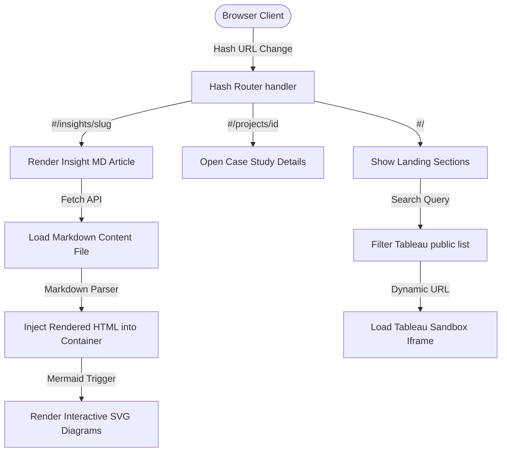

# Project Skill File: Ankur Analytics Portfolio V2

This document serves as the single source of truth for the technical architecture, design system, feature specifications, coding standards, and decision history for the **ankuranalytics.com** portfolio website.

---

## 1. Project Overview

### Purpose
An enterprise-grade, high-performance professional portfolio showcasing the expertise of Ankur Varshney, a Senior Business Intelligence Developer & Data Architect. It communicates business value, data engineering maturity, and interactive BI capabilities rather than acting as a static resume.

### Target Users
Recruiters, Hiring Managers, Directors, and Analytics Leaders in Banking, Insurance, Retail, and Cloud Platforms.

### Primary Goals
1. Demonstrate capability in solving real-world business problems.
2. Highlight enterprise analytics architecture maturity (AWS, Databricks, Snowflake, PostgreSQL, Oracle).
3. Showcase live, interactive BI visualizations (Tableau Public Showcase).
4. Share practical, deep-dive technical engineering insights.

### Technology Stack
*   **Core**: HTML5, Vanilla JavaScript (ES6+), Vanilla CSS.
*   **Fonts**: Outfit, Outfit-italic, Outfit-variable.
*   **Icons**: Hand-drawn inline SVGs (for consistent light/dark theme color inheritances).
*   **Data Layer**: Local JSON indices (`articles.json` for technical write-ups).
*   **Embedding**: Live Tableau Public Web Player inside sandbox iframe.

### Folder Structure
```text
/c:/Users/Admin/OneDrive/Documents/Ankur Github profile/
├── .git/
├── .gitignore
├── index.html                   # Core single-page application and styles
├── index_v2_backup.html          # Local backup copy of V2 code
├── plan.md                       # Historical project goals checklist
├── IMPLEMENTATION_PLAN.md        # Original Knowledge Hub specification
├── LINKEDIN_PROFILE_GUIDE.md     # Optimized LinkedIn copy templates
├── content/
│   └── insights/
│       ├── articles.json         # Index of all technical insights
│       ├── ai-in-tableau.md
│       ├── analytics-engineering.md
│       ├── athena-optimization.md
│       ├── aws-architecture.md
│       ├── dashboard-design.md
│       ├── dashboard-governance.md
│       ├── databricks-etl.md
│       ├── enterprise-rls.md
│       ├── modern-bi.md
│       ├── prompt-engineering.md
│       ├── sql-performance.md
│       ├── tableau-admin.md
│       ├── tableau-extensions.md
│       ├── tableau-performance-tuning.md     # Full guide on dashboard speed
│       ├── tableau-server-repository.md     # Guide on Postgres Workgroup database
│       └── window-functions.md
└── assets/
    ├── Ankur_Varshney_Resume.pdf # Active PDF download resume
    └── img/
        └── avatar.jpg            # Professional profile photo
```

### Deployment Process
- Push changes directly to the `main` branch of the remote Git repository: `https://github.com/vyankur/vyankur.github.io.git`.
- GitHub Actions automatically builds and deploys to GitHub Pages hosting live at [vyankur.github.io](https://vyankur.github.io).

---

## 2. Architecture



### Routing & State Management
- **Single-Page App Hash Navigation**: Implements an active event listener on `hashchange` and `DOMContentLoaded` calling `handleRouting()`.
- deep link routing maps:
  - `#/` -> Default landing page views (hides deep-link panels, scroll-rests to hash target if provided).
  - `#/insights/<slug>` -> Fetches and renders the markdown insight article, hides landing page.
  - `#/projects/<id>` -> Opens the project modal dialog page.
- **State Management**: Handled via lightweight reactive variables inside local scope (e.g. `currentVizFilter`, `vizSearchQuery`).

### Build & Deploy
- **No Bundler**: Built entirely on standard browser APIs. Zero runtime package dependencies.
- **GitHub Actions Deployment**: Automatic deployments on commit triggers.

---

## 3. Features

### Dynamic Tableau Public Showcase
*   **Purpose**: Allows visitors to filter, search, and view live interactive Tableau dashboards directly from the portfolio.
*   **Files Modified**: `index.html` (HTML structure, styles, JS list models).
*   **Business Logic**: Matches user-selected tags or searches with catalog metadata, updates iframe `src` dynamically, displays views/metadata statistics.
*   **Layout Constraint**: Spans the full widget container width across both columns (player + sidebar) to create a clean, modern aesthetic.
*   **Known Limitations**: High-intensity visualizations may load slowly if Tableau Public's servers are throttled.

### Single-Page Routing Insights Reader
*   **Purpose**: Replaces third-party CMS/Blogging engines with a blazing-fast local Markdown-to-HTML parser.
*   **Files Modified**: `index.html`, `content/insights/` files.
*   **Business Logic**: Fetches raw `.md` content from local paths, strips headers, translates markdown parameters (bold, headers, bullets, code blocks, alerts) to HTML nodes, and triggers Mermaid diagram rendering.

### Command Palette (Ctrl+K)
*   **Purpose**: Keyboard-accessible site navigator.
*   **Business Logic**: Listens for `Ctrl + K` or `Cmd + K`, opens active overlay, filters matches in real-time, handles keyboard arrow keys navigation and enter triggers.

### AI Resume Chatbot
*   **Purpose**: Simulates an AI assistant that answers recruiter questions about Ankur's skills, relocation, and experience.
*   **Business Logic**: Keyword-matching engine referencing local structured facts JSON model (`botKnowledge`). Includes smooth typing indicator delays.

---

## 4. Component Documentation

### Testimonials Grid
*   **Purpose**: Showcases real LinkedIn recommendations from direct managers and clients.
*   **HTML Classes**: `.rec-grid` (parent grid layout), `.rec-card` (standard card container), `.rec-card.featured-rec` (featured wrapper spanning both columns).
*   **Responsive Rules**: Automatically collapses to `1fr` on screens smaller than 768px.

### Project Case Study Modal
*   **Purpose**: Full-screen overlay to read problem, challenge, solution, and impact metrics.
*   **HTML ID**: `#caseStudyModal`
*   **State Hooking**: Triggered dynamically on `.project-card` click; populated by mapping ID key against `projectCaseStudies` facts object.

---

## 5. Design System

### Color System (CSS Variables)
Custom tailormade dark and light themes using sleek HSL variables:
```css
:root {
  --primary: #3b82f6;       /* Radiant Blue */
  --primary-rgb: 59, 130, 246;
  --bg: #0f172a;            /* Rich Slate Dark BG */
  --card-bg: #1e293b;
  --text: #f8fafc;
  --muted: #94a3b8;
  --border: #334155;
  --shadow: rgba(0, 0, 0, 0.3);
}

[data-theme="light"] {
  --primary: #2563eb;
  --bg: #f8fafc;            /* Clean Off-White Light BG */
  --card-bg: #ffffff;
  --text: #0f172a;
  --muted: #64748b;
  --border: #e2e8f0;
  --shadow: rgba(0, 0, 0, 0.05);
}
```

### Typography
- Primary font: `'Outfit', sans-serif` loaded from Google Fonts (variable widths 100 to 900 supported).
- Line Heights: `1.1` for section headings, `1.6` to `1.8` for body copy to prevent cognitive fatigue.

### Responsive Spacing
- Container layout wrapper: `.shell` with `max-width: 1200px; padding: 0 2rem; margin: 0 auto;`.
- Section Headings: `.section-head { max-width: 1000px; margin-bottom: 4rem; }` prevents premature heading wrap.

---

## 6. Coding Standards

### Structure & Conventions
*   **HTML5 Semantics**: Rely only on `<section>`, `<article>`, `<nav>`, `<header>` structures. Keep ID attributes unique and descriptive.
*   **Vanilla JS Separation**: Put all event bindings and logic loops inside the main `<script>` tag. Keep utility parsers separated.
*   **No Inline JS Event Bindings**: Attach all events via `addEventListener` in JS code rather than writing inline `onclick=""` in HTML tags.

### Quality Auditing & Validation
*   **Parity Validation**: Every local markdown article MUST match an index catalog item in `articles.json` and a model object inside `index.html`'s `knowledgeArticles` array.
*   **Nesting Check**: Execute `validate_html.py` after structural edits to check tags match.
*   **JS Check**: Execute `validate_js.js` to ensure script block compiles without syntax crashes.
*   **Runtime Check**: Execute `test_runtime.js` to run Javascript inside a mockup DOM context, catching undefined variables or call stack errors.

---

## 7. Challenges & Solutions

### Challenge 1: Page Crash due to JSON-LD Tag Split
*   **Root Cause**: Restored scripts were appended inside `<script type="application/ld-json">` tag which is treated as text by browser engines. The browser threw a fatal `ReferenceError: renderVizzes is not defined` when trying to run the initialization line inside the first block, freezing all page scripts.
*   **Solution**: Wrote a python parser `consolidate_js.py` to extract code blocks, unify all script executions inside a single primary `<script>` block, place `renderVizzes()` at the bottom, and separate the JSON-LD schema cleanly outside.

### Challenge 2: Browser Agent Failure on Windows OS
*   **Root Cause**: Local Chromium mode in browser subagent is only supported on Linux. Operating systems on Windows throw error immediately on page request.
*   **Solution**: Shifted to local script automation using Python subprocess to locate Edge/Chrome binaries on Windows and run with `--headless` and `--dump-dom` flags.

---

## 8. Decisions Log

| Date | Task | Decision | Reason | Files Affected |
| :--- | :--- | :--- | :--- | :--- |
| 2026-07-18 | Rebrand Section | Renamed Knowledge Hub to Insights | Fits professional analytics consultant profile better than blog terminology | `index.html`, `articles.json`, `content/` |
| 2026-07-18 | Recommendations | Built Grid layout instead of Carousel | Slideshow hidden content reduces visual readability; grid exposes quotes immediately | `index.html` |
| 2026-07-18 | Print layout | Embedded print CSS styles in index | Allows recruiters to print a clean resume layout directly from the landing page | `index.html` |
| 2026-07-19 | Tableau Widget | Restructured header to span full-width | Centering active viz title above player + sidebar columns integrates layout design better | `index.html` |
| 2026-07-19 | Resume download | Redirected LinkedIn button to profile | Linking to a local developer guide MD file is confusing; linking to profile fits portfolio standard | `index.html` |
| 2026-07-19 | Hero Header | Promoted Ankur Varshney to primary H1 | The name was previously missing from the main hero text; promoting it to clamp(3.2rem, 6.5vw, 5.2rem) serves personal branding and SEO guidelines | `index.html` |
| 2026-07-19 | Recommendations | Upgraded to Swipe Carousel | Implemented responsive slide carousel with touch support and pagination dots to display recommendations elegantly | `index.html` |
| 2026-07-19 | Workbook Sentinel Blog | Restructured as engineering case study | Documentation format replaced with challenge-based case study targeting hiring managers and senior engineers | `workbook-sentinel.md`, `articles.json`, `index.html` |
| 2026-07-20 | Tableau Calendar Extension | Replaced vague/dummy project text | Replaced placeholder text with correct React/TS/Vite extension details from Claude suggestion | `index.html`, `LINKEDIN_PROFILE_GUIDE.md` |
| 2026-07-21 | Inline SVGs & Blog alignment | Replaced broken CDN image references with inline SVG paths and renamed Blog to Featured Insights | Fixed broken Tableau image and aligned navigation & articles metadata | `index.html` |

---

## 9. AI Memory Section

*   **User Preferences**: High focus on Tableau, SQL performance, cloud analytics pipelines, and dynamic extensions.
*   **UI Preferences**: Elegant Slate Dark theme, Outfit typography, minimal container spacing, no generic bright colors.
*   **Performance Requirement**: Target Lighthouse score of >95, sub-second render, optimized DOM nodes.
*   **SEO Requirements**: Single `<h1>` per page, complete JSON-LD structured card metadata block, canonical url points to `vyankur.github.io`.

---

## 10. Current Project Status

### Completed
*   [x] Rebrand copy and headers to Senior Data Analytics Consultant.
*   [x] Implement single-page hash routing navigation.
*   [x] Build dynamic Tableau Showcase search and filters.
*   [x] Set up full-screen modal case studies.
*   [x] Integrate local markdown insight reader with Mermaid rendering.
*   [x] Unify all Javascript script blocks and fix compilation ReferenceErrors.
*   [x] Replace hypothetical testimonials with real LinkedIn recommendations.
*   [x] Update LinkedIn guide link to direct LinkedIn profile.

### In Progress
*   [ ] Verify live website deployment rendering.

### Next Recommended Tasks
1. Run local web server and verify rendering correctness of the new PostgreSQL guide article.
2. Verify Mermaid diagram rendering bounds inside the new article page layout.

---

## 11. Future Context

### Current State
All core V2 portfolio features are fully coded, debugged, validated, and pushed to remote main branch on GitHub.

### Things NOT to Change
- **Do NOT** split JavaScript execution tags again. Keep all logic unified in script block 1.
- **Do NOT** change the HSL theme variable tokens in `index.html`.
- **Do NOT** break the single-page hash navigation routes.

---

## 12. Change Log

### 2026-07-18
*   **Task**: Rebrand and fix landing page crashes.
*   **Files Changed**: `index.html`, `articles.json`.
*   **What Changed**: Renamed navigation to Insights, restored Command Palette + Chatbot listeners, isolated ReferenceError source.
*   **Why**: Restore broken interactivity.

### 2026-07-19
*   **Task**: Testimonials, layout alignments, name font size, and new PostgreSQL guide article.
*   **Files Changed**: `index.html`, `articles.json`, `content/insights/tableau-server-repository.md`.
*   **What Changed**: Added real LinkedIn recommendations, restructured Tableau widget header to span full width, increased headings max-width, redirected resume button to actual LinkedIn profile, promoted Ankur Varshney to main H1 header in Hero layout, and created the PostgreSQL Server Repository article.
*   **Why**: Implement user comments and profile expansion.

### 2026-07-19 (Session 2)
*   **Task**: Restructure Workbook Sentinel blog as engineering case study.
*   **Files Changed**: `content/insights/workbook-sentinel.md`, `content/insights/articles.json`, `index.html`.
*   **What Changed**: Completely rewrote article from documentation format to engineering case study with challenge-based sections (4 challenges with Engineering Challenge, Why Traditional Solutions Fall Short, Design Decision, Technical Implementation, Trade-offs, Outcome, Key Takeaways), architecture overview with Mermaid diagrams, design decision callout boxes, Lessons Learned, Future Improvements roadmap, My Contribution author attribution, and Technologies Used tag list. Updated metadata in articles.json and knowledgeArticles array.
*   **Why**: Transform from technical documentation into a senior engineering portfolio piece targeting hiring managers, engineering managers, and enterprise architecture teams.

### 2026-07-20
*   **Task**: Replace dummy/vague project details for Tableau Calendar Extension.
*   **Files Changed**: `index.html`, `LINKEDIN_PROFILE_GUIDE.md`.
*   **What Changed**: Updated project card tech stack and description to React, TypeScript, Vite, and CSS Grid. Upgraded projectCaseStudies['calendar'] detail structure with the real project challenges, solution, impact, learnings, and repo link. Built a custom themed architecture flowchart SVG diagram for the extension. Updated chatbot knowledge base to reference both extensions.
*   **Why**: Ensure portfolio accurately reflects the actual extension code repository and features rather than vague custom visualization placeholders.

### 2026-07-21
*   **Task**: Fix broken Tableau icons and align Blog section with Insights router.
*   **Files Changed**: `index.html`.
*   **What Changed**: Replaced external Tableau brand icon image tags with stable inline SVG paths inside project case study flowcharts. Renamed the "Blog" section to "Featured Insights" and updated card metadata (titles, descriptions, tags, and routes) to match `articles.json` and link directly to active insight router paths.
*   **Why**: Eliminate layout/resource load failures from non-existent Devicon brand references and fix navigation alignment issues.

---

========================================
PROJECT MEMORY (DO NOT DELETE)
========================================

Current Version: 2.0.6
Last Updated: 2026-07-21
Current Branch: main

Architecture Version: SPA-Hash-Router-V2

Completed Features:
- Rebranded value titles to Senior Data Analytics Consultant
- Single-page hash routing navigation mapping deep links
- Promoted Ankur Varshney name to main H1 hero heading with responsive scaling typography
- Dynamic Tableau Public Showcase list player and filters
- Unified interactive widget layout container with full-width header
- Command Palette search engine with keyboard bindings
- AI Chatbot response engine with custom knowledge factual models
- Authentic LinkedIn testimonials from Google, Sun Life, and client
- Integrated local Markdown insight reader with Mermaid schemas
- Upgraded Postgres Server Repository metadata analysis article
- Restructured Workbook Sentinel blog as engineering case study with challenge-based format
- Replaced dummy/vague project details for Tableau Calendar Extension with custom SVG flowchart and correct React/TypeScript/Vite stack details
- Fixed broken Tableau icons in diagrams with stable inline SVG shapes and aligned Blog cards with actual Insights router paths

Pending Features:
- None

Known Issues:
- Browser subagent URL loader fails on Windows platforms (workaround established via headless python dump-dom Edge subprocesses)

Technical Debt:
- Hardcoded knowledgeArticles catalog list inside index.html script block (maintained for zero-dependency standalone page reliability)

Current Priorities:
1. Verify live GitHub Pages build action completion
2. Audit mobile responsiveness of the unified Tableau layout wrapper
3. Validate Mermaid diagram sizing inside insights deep link page view

Important Decisions:
- Testimonials upgraded to responsive slide carousel layout with touch swipe support, navigation arrows, and indicators to display manager quotes neatly
- Integrated full-width headers spanning both columns on Tableau Public widget
- Linked career resume secondary action button to actual LinkedIn profile URL
- Workbook Sentinel article restructured from documentation to engineering case study format (challenge → design decision → implementation → trade-offs → outcome pattern)

Do Not Change:
- Unified script tags layout block structure
- HSL theme color tokens definitions
- Single-page hash navigation route prefixes

Preferred Patterns:
- Correlated scalar subqueries over CTEs for production Postgres repository locks safety
- SVG inline icons over font libraries for clean dark/light inheritance
- Modular Vanilla JS functions with debounce wrappers

Rejected Approaches:
- Docusaurus/MkDocs engines (rejected in favor of local markdown router to maintain visual identity)
- TailwindCSS frameworks (rejected in favor of vanilla CSS variables to keep file footprints small)
- CTE recursion querying on production Tableau repository databases

Files Requiring Extra Caution:
- index.html (highly sensitive, contains core HTML layout, global CSS design tokens, and unified Javascript runtime code)

Next AI Session Should Start With:
1. Read this file completely.
2. Verify the project structure.
3. Review the latest changelog.
4. Continue only from the documented state.
5. Update this file before ending the session.
========================================
