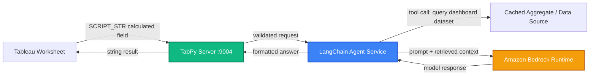

# AI in Tableau: Connecting Amazon Bedrock and LangChain Agents via TabPy

Turning a plain-English question typed into a dashboard into a governed call against an Amazon Bedrock foundation model, routed through a LangChain agent that lives behind TabPy.

---

## Overview

Most people meet TabPy through small statistical scripts: a forecast, a clustering pass, a regression score returned into a calculated field. It's a smaller step from there than it looks to something more ambitious, routing a calculated field through TabPy into a LangChain agent, and having that agent call an Amazon Bedrock foundation model to answer a question a dashboard user typed in plain English.

This article lays out that architecture end to end: TabPy as the transport layer between Tableau and Python, a small LangChain agent as the orchestration layer that decides which tool or data slice a question needs, and Bedrock as the model layer that generates the final answer. It also covers the guardrails, authentication, timeouts, and response caching, that separate a working notebook demo from something a business user can click on a live dashboard without timing it out.

> [!IMPORTANT]
> Design Decision: TabPy is used purely as a transport, not as the place where LLM logic lives. The Python function registered with TabPy stays thin, it validates the request and forwards it to a separate LangChain agent service. Keeping the agent out of the TabPy process makes it independently testable, deployable, and scalable away from the Tableau Server host.

---

## Why route through TabPy instead of a custom extension

A Tableau Dashboard Extension (the same mechanism behind write-back forms and custom UI panels) can call an LLM directly from the browser sandbox, and for a dedicated chat-style panel that's often the better choice. TabPy earns its place when the requirement is different: the answer needs to live inside a calculated field, alongside existing measures, filterable and sortable like any other value on the sheet, not confined to a separate panel.

That constraint shapes the whole design. A calculated field can only call `SCRIPT_STR` (or `SCRIPT_INT`/`SCRIPT_REAL`/`SCRIPT_BOOL`) synchronously, wait for the response, and render it in the mark. There's no persistent chat state at that layer, no streaming tokens, no follow-up turns. Every call is stateless from Tableau's point of view, which pushes conversational memory and multi-step reasoning down into the LangChain agent, where they belong.

---

## Architecture: from a worksheet to a Bedrock response



Four layers, each with one job:

* **Tableau worksheet** sends the parameter text (the user's question) and any needed field values into a `SCRIPT_STR` calculated field.
* **TabPy server** exposes a registered Python endpoint, validates the incoming payload, and forwards it, it does not call Bedrock itself.
* **LangChain agent service** is a small standalone Python service (FastAPI works well) that owns the prompt template, decides whether the question needs a tool call against the dashboard's underlying data, and assembles the final prompt.
* **Amazon Bedrock Runtime** hosts the model (Anthropic Claude on Bedrock is a common choice for this pattern) and returns the generated text.

> [!TIP]
> Keeping the agent service separate from TabPy means it can be scaled, versioned, and redeployed without touching the Tableau Server TabPy configuration, and it can be reused by other consumers (a Slack bot, an internal API) that have nothing to do with Tableau.

---

## Setting up TabPy securely

TabPy ships with an authentication mode that's worth turning on before anything else, since an unauthenticated TabPy endpoint that can reach an LLM (and, transitively, your AWS account) is a meaningful exposure if the server is reachable beyond the corporate network.

```bash
# Start TabPy with authentication and TLS enabled via config file
tabpy-server --config=tabpy.conf
```

```ini
# tabpy.conf
[TabPy]
TABPY_PORT = 9004
TABPY_EVALUATE_ENABLE = false
TABPY_TRANSFER_PROTOCOL = https
TABPY_CERTIFICATE_FILE = /etc/tabpy/cert.pem
TABPY_KEY_FILE = /etc/tabpy/key.pem
```

> [!WARNING]
> Set `TABPY_EVALUATE_ENABLE = false` in any deployment that exposes TabPy beyond a single developer machine. The `/evaluate` endpoint runs arbitrary Python on the TabPy host; only the deployed, reviewed functions registered through `/query` should be reachable in production.

Deploying the function itself is a normal TabPy `deploy` call, the function body is intentionally thin:

```python
from tabpy.tabpy_tools.client import Client
import requests

def ask_dashboard_agent(question, context_metric, context_value):
    """Forwards a dashboard question to the LangChain agent service.
    Stays thin on purpose: no prompt logic, no Bedrock SDK calls here."""
    response = requests.post(
        "https://agent-service.internal:8080/ask",
        json={
            "question": question,
            "metric": context_metric,
            "value": context_value,
        },
        timeout=8,
        headers={"Authorization": f"Bearer {INTERNAL_SERVICE_TOKEN}"},
    )
    response.raise_for_status()
    return response.json()["answer"]

client = Client("https://tabpy-server.internal:9004/")
client.deploy("ask_dashboard_agent", ask_dashboard_agent,
               "Routes a natural-language dashboard question to the LangChain agent.",
               override=True)
```

---

## The LangChain agent behind TabPy

The agent service is where the actual reasoning happens. It receives the question and whatever context Tableau passed along, decides whether it needs to pull a fresh aggregate from the data source before answering, and calls Bedrock with an assembled prompt.

```python
from langchain_aws import ChatBedrock
from langchain.agents import AgentExecutor, create_tool_calling_agent
from langchain_core.prompts import ChatPromptTemplate

llm = ChatBedrock(
    model_id="anthropic.claude-3-5-sonnet-20241022-v2:0",
    region_name="us-east-1",
    model_kwargs={"temperature": 0, "max_tokens": 400},
)

prompt = ChatPromptTemplate.from_messages([
    ("system", "You answer questions about a Tableau dashboard's KPIs. "
               "Be concise, one to two sentences, and cite the metric name and value "
               "you were given rather than inventing figures."),
    ("human", "{question}\n\nContext metric: {metric} = {value}"),
    ("placeholder", "{agent_scratchpad}"),
])

agent = create_tool_calling_agent(llm, tools=[lookup_kpi_history], prompt=prompt)
executor = AgentExecutor(agent=agent, tools=[lookup_kpi_history], max_iterations=3)
```

`temperature=0` matters more here than in a general-purpose chatbot. A calculated field renders the same string for every mark that shares the same partition, so a nondeterministic answer shows up as visibly inconsistent text sitting next to an otherwise stable number, which undermines trust in the dashboard faster than a slow response does.

---

## Writing the Tableau calculated field

On the Tableau side, the calculated field is intentionally simple, it passes the question and the relevant context fields and expects a single string back:

```
SCRIPT_STR(
    "return tabpy.query('ask_dashboard_agent', _arg1, _arg2, _arg3)['response']",
    [Parameters].[Question],
    ATTR([KPI Name]),
    SUM([KPI Value])
)
```

> [!TIP]
> Aggregate every measure passed into the script (`SUM`, `AVG`, `ATTR`) so the calculation resolves at the level of detail the viz is actually drawn at. An unaggregated field in a `SCRIPT_STR` call is one of the most common causes of "cannot mix aggregate and non-aggregate" errors when wiring TabPy into an existing worksheet.

---

## Caching, latency, and cost control

A Bedrock round trip through an agent that may itself call a tool typically lands somewhere between one and three seconds, more if the agent needs a second reasoning pass. That's tolerable for a one-off question triggered by a parameter action, but not for a value recalculated on every filter change across a full crosstab.

| Layer | What gets cached | Typical TTL |
| :--- | :--- | :--- |
| Agent service | Question + context hash to answer | 15-30 min |
| TabPy function | Nothing (stateless passthrough) | n/a |
| Tableau | Extract refresh, not the LLM answer itself | Per extract schedule |

The practical pattern is to cache at the agent service on a hash of the question text plus the context values it was given, since dashboard users tend to ask the same handful of questions ("why did this drop", "how does this compare to last quarter") far more often than they ask something genuinely novel. A simple in-memory or Redis-backed cache in front of the Bedrock call cuts both latency and token spend substantially without touching the Tableau side at all.

> [!IMPORTANT]
> Design Decision: Scope the calculated field to a parameter action (a button click, an "Ask" action) rather than a live filter-driven recalculation. This keeps the number of Bedrock invocations proportional to how often a user actually asks a question, not to how often the view redraws.

---

## Key learnings

* **Keep TabPy thin.** It should validate and forward, not hold prompt templates or SDK credentials, so the agent logic can evolve and scale independently of the Tableau Server host.
* **Determinism is a dashboard requirement, not a nice-to-have.** `temperature=0` and a tight system prompt keep repeated marks from showing inconsistent text for the same underlying value.
* **Cache on question and context, not on the raw request.** Most dashboard questions repeat; a short-TTL cache in the agent service is the single biggest lever on both latency and Bedrock cost.
* **Gate invocation behind a deliberate user action.** Wiring an LLM call to a live filter change turns every dashboard interaction into a paid API call; a parameter-driven "Ask" action keeps usage proportional to genuine intent.
* **Lock down `/evaluate` before anything else.** TabPy's authentication and evaluate-disable settings are the first thing to configure, not an afterthought once the integration works.
