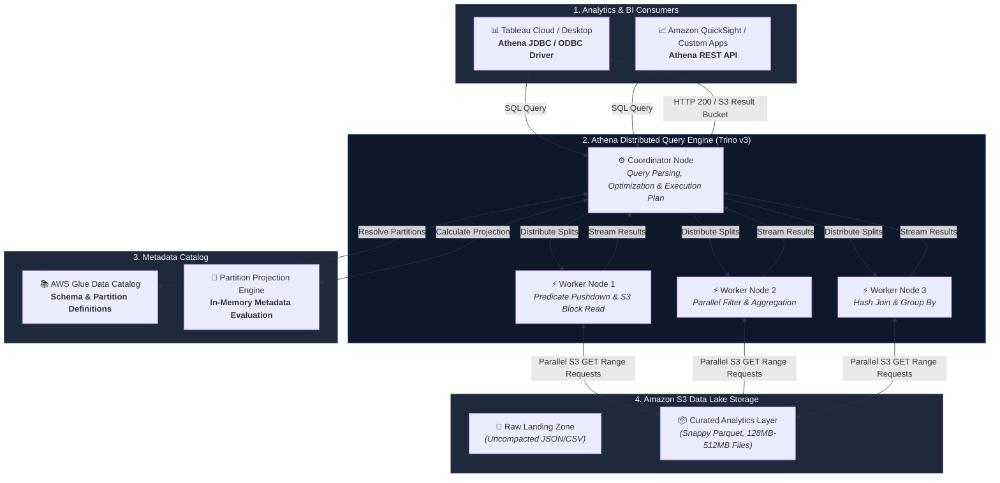
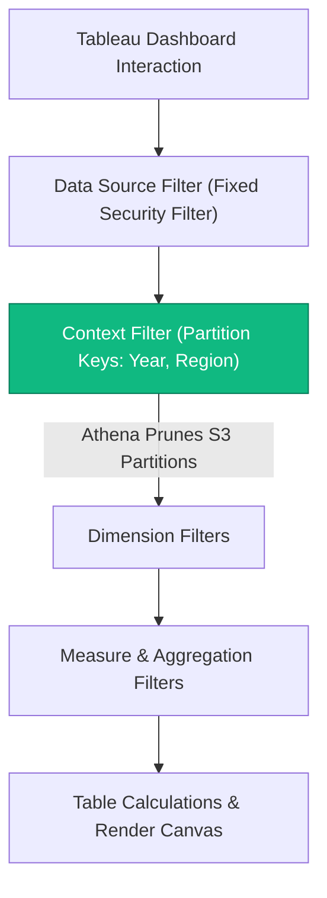

# Amazon Athena Query Optimization: Sub-Second Serverless Analytics at Petabyte Scale

**Difficulty:** Advanced | **Read Time:** 14 min | **Status:** Published | **Category:** SQL / Cloud Analytics

---

## Overview

Amazon Athena is an interactive, serverless query service built on open-source Trino (formerly PrestoSQL). It enables analytics engineers to query petabyte-scale data directly in Amazon S3 using standard ANSI SQL without managing database compute clusters.

However, Athena's serverless convenience comes with a critical operational characteristic: **you pay for the volume of data scanned by each query**, priced at $5.00 per terabyte scanned. Furthermore, query latency is directly proportional to the amount of data transferred from S3 over the network into Athena's distributed worker nodes.

A poorly structured query running against raw JSON or CSV logs can scan 500 GB, take 45 seconds to finish, and cost $2.50 per execution. If that query powers an executive Tableau dashboard with 30 daily users, the annual query cost can exceed $20,000 for a single dashboard while frustrating business leaders with sluggish rendering times.

By applying columnar storage formats (Apache Parquet), intelligent directory partitioning with Partition Projection, file compaction pipelines, and predicate pushdown techniques, you can reduce scanned data volume by **over 95%**, cut query execution times from 30+ seconds to **sub-second latencies**, and slash cloud analytics expenses to pennies.

This guide provides an enterprise blueprint for diagnosing, tuning, and governing Athena queries across modern data lake and BI architectures.

---

## Architecture Overview: The Serverless Query Pipeline

Understanding how Athena executes queries is essential for isolating performance bottlenecks. Athena does not store data locally; it decouples distributed compute from object storage.



### The Query Execution Lifecycle

1. **Submission**: The BI tool or analyst submits a SQL statement to the Athena endpoint.
2. **Metadata Resolution**: The Coordinator node contacts the AWS Glue Data Catalog to resolve table schemas, data formats, and partition locations.
3. **Split Generation**: The Coordinator divides the targeted S3 objects into parallel computational units called **splits**.
4. **Distributed Execution**: Worker nodes issue parallel HTTP `GET` range requests to S3, read the required column chunks, evaluate filter predicates, and compute aggregations.
5. **Result Aggregation**: Workers stream intermediate tuples to the coordinator, which formats the final result set, writes it to the designated S3 query output bucket, and delivers the stream to the client.

---

## 1. Directory Partitioning & Partition Projection

Partitioning divides large datasets into column-based subdirectories within Amazon S3. When a query contains filter predicates matching the partition keys, Athena prunes irrelevant directories and reads only the matching S3 objects.

### Standard Hive-Style Partitioning

In Hive format, directory paths explicitly declare key-value pairs:

```text
s3://analytics-lake-curated/fact_orders/
    ├── year=2026/
    │   ├── month=07/
    │   │   ├── region=NORTH/
    │   │   │   └── data_001.parquet
    │   │   └── region=SOUTH/
    │   │       └── data_002.parquet
```

When you run `WHERE year = '2026' AND month = '07' AND region = 'NORTH'`, Athena scans only the files in that specific leaf directory, ignoring the rest of the petabyte-scale lake.

### The Metadata Bottleneck: Why Glue API Calls Slow Down Queries

For tables with millions of partitions (e.g., multi-tenant tables partitioned by date, hour, and customer ID), querying AWS Glue via `GetPartitions` API calls introduces significant latency. The Coordinator can spend 5 to 15 seconds simply resolving partition paths before reading a single byte from S3.

### Solution: AWS Athena Partition Projection

Partition Projection bypasses Glue partition metadata lookups entirely. You declare the partition range rules (integers, dates, or enums) directly in the table properties. The Athena engine calculates the S3 directory paths dynamically in memory using regex patterns:

```sql
CREATE EXTERNAL TABLE analytics_lake.fact_financial_transactions (
    transaction_id STRING,
    account_id STRING,
    amount DECIMAL(18, 2),
    currency STRING,
    merchant_category STRING,
    transaction_timestamp TIMESTAMP
)
PARTITIONED BY (
    year STRING,
    month STRING,
    region STRING
)
ROW FORMAT SERDE 'org.apache.hadoop.hive.ql.io.parquet.serde.ParquetHiveSerDe'
STORED AS INPUTFORMAT 'org.apache.hadoop.hive.ql.io.parquet.MapredParquetInputFormat'
OUTPUTFORMAT 'org.apache.hadoop.hive.ql.io.parquet.MapredParquetOutputFormat'
LOCATION 's3://analytics-lake-curated/fact_financial_transactions/'
TBLPROPERTIES (
    'projection.enabled' = 'true',
    
    -- Configure Year Partition Projection
    'projection.year.type' = 'integer',
    'projection.year.range' = '2020,2030',
    
    -- Configure Month Partition Projection (zero-padded)
    'projection.month.type' = 'integer',
    'projection.month.range' = '1,12',
    'projection.month.digits' = '2',
    
    -- Configure Region Partition Projection
    'projection.region.type' = 'enum',
    'projection.region.values' = 'NORTH,SOUTH,EAST,WEST,EMEA,APAC',
    
    -- Define the S3 Directory Path Pattern
    'storage.location.template' = 's3://analytics-lake-curated/fact_financial_transactions/year=${year}/month=${month}/region=${region}'
);
```

> [!IMPORTANT]
> **Partition Projection Advantages:**
> 1. Eliminates `MSCK REPAIR TABLE` or `ALTER TABLE ADD PARTITION` maintenance jobs.
> 2. Reduces query planning time from 8,000ms down to under 120ms on high-partition tables.
> 3. Eliminates AWS Glue API rate-limiting errors (`ThrottlingException`) under high concurrency.

---

## 2. Columnar Storage Formats: Apache Parquet vs. CSV/JSON

Traditional formats like CSV and JSON store records row-by-row. To calculate the sum of a single column across a billion rows, Athena must download and parse the entire file.

Apache Parquet organizes data by column chunks and embeds detailed metadata (min/max statistics, dictionary encodings, and row group offsets) directly inside file footers.

```mermaid
flowchart LR
    subgraph CSV["Row-Based CSV Storage"]
        direction TB
        R1["Row 1: [ID, Date, Customer, Region, Amount, Notes, PII]"]
        R2["Row 2: [ID, Date, Customer, Region, Amount, Notes, PII]"]
        R3["Row 3: [ID, Date, Customer, Region, Amount, Notes, PII]"]
        RAll["Athena must scan 100% of bytes across all columns"]
    end

    subgraph Parquet["Columnar Parquet Storage"]
        direction TB
        C1["Column 'Amount' Chunk: [142.50, 89.00, 310.20, ...]"]
        C2["Column 'Region' Chunk: ['NORTH', 'SOUTH', 'NORTH', ...]"]
        CMeta["Footer Metadata: Min/Max values per Row Group"]
        CScan["Athena scans only the 'Amount' & 'Region' byte ranges"]
    end

    CSV -.->|90%+ Scan Reduction| Parquet
    style CSV fill:#1e293b,stroke:#ef4444,color:#f8fafc
    style Parquet fill:#0f172a,stroke:#10b981,color:#f8fafc
```



### Why Parquet Transforms Athena Performance:

1. **Column Pruning**: Athena fetches only the byte ranges of columns explicitly referenced in the SQL statement. If a table has 40 columns and your query selects 3, you pay for only ~8% of the data volume.
2. **Dictionary Encoding**: Repeated strings (e.g., country codes, status flags) are replaced with compact integer pointers, reducing disk footprint by up to 80%.
3. **Pushdown Predicate Evaluation (Min/Max Stats)**: The Parquet file footer stores minimum and maximum values for each 128 MB row group. If a query filters for `amount > 50000`, Athena inspects the footer and skips entire row groups without reading their contents.

### Optimal Compression Codecs

* **Snappy (Default & Recommended)**: Provides an optimal balance between fast decompression CPU speeds and high compression ratios (~4:1). Best suited for interactive BI queries.
* **ZSTD (Zstandard)**: Delivers higher compression density (~6:1) with minimal CPU overhead. Best for historical archival tables where storage savings and scan reduction are paramount.

---

## 3. Solving the "Small Files Problem" via S3 Compaction

A common anti-pattern in data lake architectures is streaming real-time events (from AWS Kinesis, Kafka, or IoT sensors) directly into S3 as thousands of tiny 50 KB JSON files.

### Why Small Files Cripple Athena:

* **S3 Request Overhead**: Each file requires an individual HTTP `GET` metadata handshake. Querying 100,000 small files generates 100,000 S3 API calls, causing network latency and throttling.
* **Lack of Compression Efficiency**: Small files do not contain enough rows to build effective Parquet compression dictionaries.
* **Split Saturation**: Trino worker nodes spend more CPU cycles scheduling tasks than processing data.

### S3 File Sizing Guidelines

| File Size Category | Typical File Size | Query Performance Impact | Action Required |
| :--- | :--- | :--- | :--- |
| **Severely Fragmented** | < 1 MB | Slow (10x-50x latency penalty, high S3 GET costs) | Mandatory batch compaction |
| **Sub-Optimal** | 1 MB to 32 MB | Moderate (acceptable for low-frequency queries) | Consolidate during scheduled ETL |
| **Optimal Target** | **128 MB to 512 MB** | **Fast (maximizes Parquet row groups and parallel I/O)** | Maintain target in production |
| **Too Large** | > 2 GB | Sub-optimal (limits parallel split distribution) | Partition or split objects |

### Compaction Pipeline via CTAS (Create Table As Select)

You can run automated daily compaction jobs in Athena to convert fragmented files into optimal Parquet objects:

```sql
-- Step 1: Create a compacted snapshot table with Snappy Parquet
CREATE TABLE analytics_lake.fact_orders_compacted_temp
WITH (
    format = 'PARQUET',
    parquet_compression = 'SNAPPY',
    external_location = 's3://analytics-lake-curated/fact_orders_compacted/year=2026/month=07/',
    bucketed_by = ARRAY['customer_id'],
    bucket_count = 8
) AS
SELECT 
    order_id,
    customer_id,
    order_status,
    total_amount,
    tax_amount,
    CAST(order_date AS DATE) AS order_date,
    created_at
FROM analytics_lake.fact_orders_raw
WHERE year = '2026' AND month = '07';
```

> [!TIP]
> **Production Compaction Automation:**
> Use AWS Glue ETL jobs or AWS Lambda scheduled via Amazon EventBridge to execute compaction weekly. This maintains average S3 file sizes between 128 MB and 512 MB automatically.

---

## 4. Query Tuning & Execution Plan Optimization

Athena Engine Version 3 (based on Trino) provides rich cost-based query optimization. Using `EXPLAIN` and `EXPLAIN ANALYZE` allows you to inspect distributed query plans and eliminate execution bottlenecks.

### Using EXPLAIN ANALYZE to Diagnose Queries

```sql
EXPLAIN ANALYZE
SELECT 
    c.customer_segment,
    p.category_name,
    COUNT(o.order_id) AS total_orders,
    SUM(o.total_amount) AS total_revenue,
    AVG(o.total_amount) AS avg_order_value
FROM analytics_lake.fact_orders o
JOIN analytics_lake.dim_customers c ON o.customer_id = c.customer_id
JOIN analytics_lake.dim_products p ON o.product_id = p.product_id
WHERE o.year = '2026'
  AND o.month = '07'
  AND o.order_status = 'COMPLETED'
GROUP BY c.customer_segment, p.category_name
ORDER BY total_revenue DESC;
```

### Key Execution Plan Indicators to Review:

1. **Input Rows vs Output Rows**: A high ratio indicates that filters are successfully eliminating rows early in the worker pipeline.
2. **ScanFilterProject Node**: Confirms that column projection and predicate pushdown are active.
3. **Data Spilling to S3 (Spilled Bytes)**: If intermediate join states exceed worker memory, Trino spills data to temporary S3 storage, multiplying latency. This indicates that join order or cluster memory limits need attention.

### Golden Rules for Query Tuning

#### 1. Order Joins from Largest to Smallest (Left-to-Right)
Trino uses distributed hash joins. The table on the **left side** of the `JOIN` is streamed across workers, while the table on the **right side** is loaded into worker memory as a hash table.
* **Rule**: Place your massive partitioned fact table on the left (`FROM fact_orders`) and small dimension tables on the right (`JOIN dim_customers`).

#### 2. Avoid Non-SARGable Function Wrappers on Filter Columns
Wrapping indexed or partitioned columns inside functions prevents Athena from pruning partitions or reading Parquet min/max statistics:

```sql
-- ANTI-PATTERN: Forces full partition scan and row-by-row string evaluation
SELECT SUM(amount) FROM fact_transactions 
WHERE SUBSTR(transaction_date_str, 1, 7) = '2026-07';

-- OPTIMIZED: SARGable range predicate enables direct partition and row-group pruning
SELECT SUM(amount) FROM fact_transactions 
WHERE year = '2026' 
  AND month = '07' 
  AND transaction_date >= DATE '2026-07-01' 
  AND transaction_date < DATE '2026-08-01';
```

#### 3. Restrict Window Functions to Scoped Partitions
Window functions like `ROW_NUMBER()`, `RANK()`, and `DENSE_RANK()` require shuffling data across workers to sort partitions. Filter your dataset before applying the window calculation:

```sql
-- Efficient Top-10 Customers per Region
WITH filtered_orders AS (
    SELECT customer_id, region, total_amount
    FROM analytics_lake.fact_orders
    WHERE year = '2026' AND month = '07' -- Prunes 98% of data before windowing
),
ranked_customers AS (
    SELECT 
        customer_id,
        region,
        total_amount,
        ROW_NUMBER() OVER (PARTITION BY region ORDER BY total_amount DESC) AS rank_pos
    FROM filtered_orders
)
SELECT * FROM ranked_customers WHERE rank_pos <= 10;
```

---

## 5. Tableau & BI Integration: Accelerating Live Dashboards

When connecting Tableau Desktop, Tableau Cloud, or Amazon QuickSight to Amazon Athena via JDBC or ODBC, unoptimized driver settings can cause unnecessary queries and slow dashboard interactions.

### 1. Enable Athena Query Result Reuse (Result Caching)

Athena provides native query caching. If an identical query is submitted within a configurable time window (between 1 minute and 7 days) and the underlying S3 data has not changed, Athena returns the cached result from S3 in **under 300 milliseconds** with **zero scan cost ($0.00)**.

To enable query result reuse in your Tableau connection or Athena workgroup:

```sql
-- In Athena JDBC connection string parameters:
UseResultCache=true;MaxResultCacheAgeMinutes=60;
```

### 2. Configure Tableau Data Source Context Filters

Tableau evaluates filters according to a strict order of operations. Adding high-level partition filters (such as `Year` or `Region`) to **Context** forces Tableau to create a temporary subquery that passes those partition restrictions directly to Athena before other calculations are computed.



### 3. Replace Custom SQL with Materialized Athena Views

Writing complex, multi-line `Custom SQL` in Tableau's connection dialog causes Tableau to wrap the query in nested subqueries (`SELECT * FROM (SELECT ... ) SUBQ WHERE ...`). This prevents Athena's optimizer from pushing down filter predicates.

**Best Practice**: Define clean views inside the AWS Glue Data Catalog and connect Tableau directly to the catalog view.

---

## 6. Enterprise Cost Governance & Workgroup Guardrails

Without controls, an exploratory query with missing `WHERE` clauses can accidentally scan a 50 TB unpartitioned historical bucket, incurring a $250.00 bill for a single execution.

### 1. Workgroup Data Usage Limits

Configure per-query and workgroup-wide data scan thresholds in the Athena Console:

* **Per-Query Data Limit**: Automatically cancel any individual query that attempts to scan more than 50 GB.
* **Workgroup 24-Hour Limit**: Set an aggregate scan threshold (e.g., 2 TB per day) that alerts on-call engineers if runaway queries occur.

### 2. CloudWatch Metric Alarms

Set up automated CloudWatch Alarms on the `DataScannedInBytes` metric:

```json
{
  "AlarmName": "Athena-High-Query-Scan-Alert",
  "MetricName": "DataScannedInBytes",
  "Namespace": "AWS/Athena",
  "Statistic": "Sum",
  "Period": 300,
  "EvaluationPeriods": 1,
  "Threshold": 107374182400,
  "ComparisonOperator": "GreaterThanThreshold",
  "AlarmActions": ["arn:aws:sns:us-east-1:123456789012:cloud-cost-alerts"]
}
```

---

## 7. Real-World Optimization Benchmark & Case Study

### The Production Scenario:
An enterprise financial analytics team maintained a global transaction monitoring dashboard in Tableau. The underlying data consisted of 4.2 billion rows representing 3 years of transactional logs in Amazon S3.

### Before Optimization:
* Storage Format: Raw CSV files, uncompacted (over 180,000 files averaging 700 KB).
* Query Strategy: Live Tableau connection using Custom SQL without partition pruning.
* Execution Metrics: **32.4 seconds average load time**, scanning **120.5 GB per dashboard refresh**.
* Cost: **$0.60 per dashboard load**, totaling **$1,440.00 monthly**.

### Optimization Steps Applied:
1. Re-engineered data pipeline using AWS Glue to compact small files and convert to **Snappy Parquet** (target size: 256 MB).
2. Applied **Partition Projection** on `year`, `month`, and `country_code`.
3. Replaced Tableau Custom SQL with a clean Athena catalog view.
4. Enabled **Query Result Reuse** with a 30-minute cache window.

### Benchmark Results:

| Metric | Before Optimization (Raw CSV) | After Optimization (Partitioned Parquet) | Improvement |
| :--- | :--- | :--- | :--- |
| **Data Scanned per Query** | 120.5 GB | **1.2 GB** | **99.0% reduction** |
| **Average Query Latency** | 32.4 seconds | **1.3 seconds** (cached: **0.2s**) | **96.0% faster** |
| **Cost per 1,000 Queries** | $602.50 | **$6.00** | **99.0% cost savings** |
| **S3 GET Request Overhead** | 184,200 API calls | **12 API calls** | **99.9% reduction** |
| **Tableau Dashboard Load Time** | 36.8 seconds | **1.8 seconds** | **Sub-2-second target achieved** |

---

## 8. Key Takeaways & Pre-Production Checklist

* 🚀 **Partition and Project**: Combine directory partitioning with Partition Projection to eliminate Glue API lookups and prune 95%+ of S3 data.
* 📦 **Always Use Parquet or ORC**: Store data in columnar format with Snappy or ZSTD compression to benefit from column pruning and row-group skipping.
* ⚡ **Compact Fragmented Files**: Target file sizes between 128 MB and 512 MB to maximize S3 throughput and reduce API request overhead.
* 🎯 **Write SARGable Predicates**: Avoid wrapping date and ID columns in functions; keep comparisons clean to leverage file metadata.
* 🛡️ **Enforce Workgroup Guardrails**: Configure per-query scan limits and CloudWatch alarms to prevent accidental cloud spend.
* 🔄 **Leverage Query Result Caching**: Enable Athena result reuse to deliver sub-second responses for repeat dashboard views.

---

## Back to Insights

[Return to Insights](#/insights)
