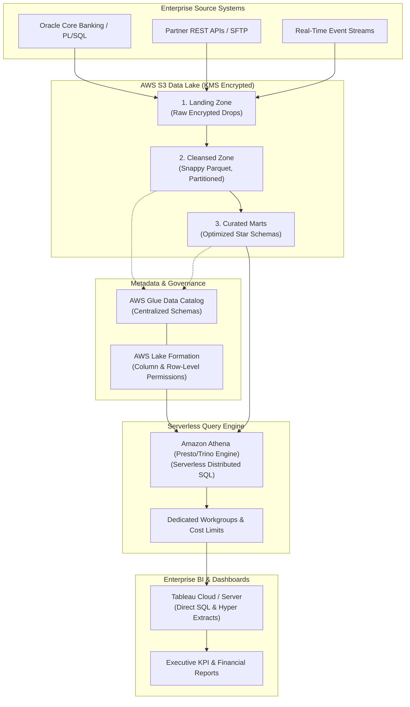
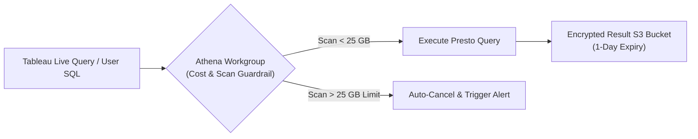

# Architecting Enterprise Cloud Analytics on AWS: S3, Glue, Athena, and Tableau Server Topology

**Difficulty:** Advanced | **Read Time:** 15 min | **Status:** Published | **Category:** Cloud Architecture / AWS Analytics

---

## 1. Executive Blueprint: Modern Cloud Analytics Topology

Building an enterprise-grade analytics platform on Amazon Web Services (AWS) requires decoupling **storage**, **metadata management**, **serverless compute**, and **business intelligence presentation**.

This decoupled architecture allows financial services, insurance, and retail enterprises to scale data volumes to petabytes while maintaining sub-second BI response times, fine-grained access control, and predictable cloud operating costs.



---

## 2. Multi-Tier S3 Data Lake Organization

To avoid "data swamps" and ensure strict lifecycle policies, data is isolated across three distinct S3 bucket zones:

### Zone 1: Landing Zone (`s3://corp-analytics-landing/`)
* **Purpose:** High-throughput intake for batch files, CSV feeds, and JSON payload drops.
* **Storage Class:** S3 Standard with 30-day lifecycle auto-transition to S3 Glacier or expiration.
* **Security:** SSE-KMS customer-managed keys (CMK) with bucket-level encryption enforcement (`aws:SecureTransport` SSL only).

### Zone 2: Cleansed Zone (`s3://corp-analytics-cleansed/`)
* **Purpose:** Standardized, columnar datasets converted from raw feeds into Apache Parquet with Snappy or ZSTD compression.
* **Partitioning Strategy:** Partitioned by high-cardinality time keys:
  ```text
  s3://corp-analytics-cleansed/fact_orders/year=2026/month=08/day=08/part-001.snappy.parquet
  ```

### Zone 3: Curated Analytics Marts (`s3://corp-analytics-curated/`)
* **Purpose:** Conformed dimensional models (Facts and Dimensions) joined, pre-aggregated, and formatted specifically for Tableau Desktop and Athena queries.
* **Optimization:** Compaction pipelines maintain file sizes between 128 MB and 512 MB to maximize Athena parallel read splits.

---

## 3. Metadata Governance with AWS Glue Data Catalog

The **AWS Glue Data Catalog** acts as a unified Hive metastore replacement across AWS services. Rather than maintaining manual table schemas in Athena, AWS Glue Crawlers and Glue ETL jobs register and update table definitions automatically.

### Automated Glue Crawler Best Practices:
1. **Schema Change Policies:** Configure Crawlers to `LOG` or `IGNORE` new columns during incremental runs to prevent schema mismatch errors during live BI reporting.
2. **Partition Indexing:** For tables exceeding 50,000 partition directories, create **Glue Partition Indexes**. Partition indexes reduce metadata retrieval times in Athena from 8+ seconds to less than 150 milliseconds.

```python
import boto3

glue_client = boto3.client('glue', region_name='us-east-1')

# Create a partition index to accelerate Athena queries
response = glue_client.create_partition_index(
    DatabaseName='enterprise_curated',
    TableName='fact_financial_transactions',
    PartitionIndex={
        'Keys': ['region_code', 'year_month'],
        'IndexName': 'idx_region_yearmonth'
    }
)
print("Partition Index created successfully:", response)
```

---

## 4. Amazon Athena Query Engine Topology & Cost Control

Amazon Athena charges based on the number of bytes scanned ($5.00 per TB in standard AWS regions). Without proper guardrails, poorly written ad-hoc queries scan entire historical tables and drive up cloud spend.

### Implementing Athena Workgroup Guardrails



1. **Per-Query Data Limits:** Set hard scan caps on development workgroups (e.g. max 25 GB scanned per query) to terminate unpartitioned `SELECT *` statements automatically.
2. **Workgroup Isolation:** Separate **Tableau Production Workgroup** (dedicated capacity, higher scan limit) from **Ad-Hoc Exploration Workgroup**.
3. **Query Result Lifecycle:** Configure query result output locations with a 24-hour lifecycle deletion rule to eliminate storage bloat from cached CSV results.

---

## 5. Secure Tableau Server & VPC Peering Architecture

Connecting Tableau Server (deployed on-premise, on EC2, or Tableau Cloud) to AWS Athena requires a secure, credentialed proxy model:

```sql
-- IAM Role Delegation with Lake Formation Fine-Grained Permissions
-- Tableau authenticates using IAM AssumeRole or AWS Secrets Manager credentials
-- Restricting Athena queries strictly to authorised corporate entities:

GRANT SELECT (transaction_id, customer_id, masked_account, transaction_amount, transaction_date)
ON TABLE enterprise_curated.fact_financial_transactions
TO ROLE 'TableauAnalyticsRole'
WHERE region_code IN ('NA_EAST', 'NA_WEST', 'EMEA');
```

### High-Availability Tableau Connection Checklist:
* **JDBC Driver Configuration:** Install the official Simba Athena JDBC driver on all Tableau Server nodes with `MaxScanBytes`, `StreamingResults=1`, and `Workgroup` parameters configured.
* **IAM Least Privilege:** Assign IAM policies with explicit `athena:StartQueryExecution`, `s3:GetObject`, and `glue:GetTable` permissions restricted to curated S3 bucket ARNs.
* **TLS 1.3 Transport:** Force encrypted SSL communication between Tableau and the AWS Athena endpoint (`athena.us-east-1.amazonaws.com:443`).

---

## 6. Architecture Comparison: AWS Serverless vs Traditional RDBMS

| Dimension | Legacy Enterprise RDBMS (Oracle/DB2) | Modern AWS Serverless Lakehouse (S3/Glue/Athena) |
|---|---|---|
| **Storage & Compute** | Tightly coupled on fixed hardware | Completely decoupled; pay only for S3 storage & Athena queries |
| **Scalability** | Expensive vertical scaling and storage upgrades | Virtually limitless horizontal scaling across petabyte S3 buckets |
| **Maintenance** | Complex vacuuming, index rebuilds, and disk allocation | Zero infrastructure patching; serverless managed engines |
| **Disaster Recovery** | Cross-site replication requires dedicated secondary servers | S3 Cross-Region Replication (CRR) with 99.999999999% durability |
| **BI Integration** | Direct ODBC connection with connection pool limits | Massively parallel Presto execution with Tableau extracts & live queries |

---

## 7. Related Architectural Blueprints
* [Databricks ETL Pipelines: Building Resilient Lakehouse Architectures](#/insights/databricks-etl)
* [Amazon Athena Query Optimization at Scale](#/insights/athena-optimization)
* [Row-Level Security & Entitlement Architecture](#/insights/enterprise-rls)
* [Tableau Server Repository Analytics & Metadata Architecture](#/insights/tableau-server-repository)
