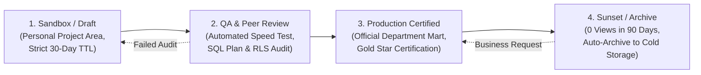
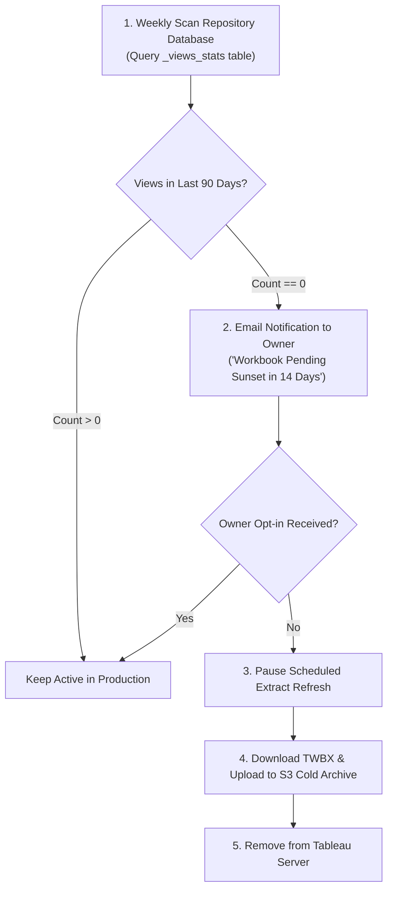

# Enterprise Dashboard Governance: Lifecycle Management, Automated Audits, and Certification at Scale

**Difficulty:** Advanced | **Read Time:** 15 min | **Status:** Published | **Category:** Platform Administration & Governance

---

## 1. The Challenge of Enterprise BI Sprawl

In enterprise deployments with hundreds of analysts across global business units, Tableau Server and Power BI environments rapidly devolve into disorganized sprawl:

1. **Orphan Workbooks:** Thousands of abandoned, unviewed dashboards consume backgrounder worker schedules and gigabytes of cloud storage.
2. **Duplicate Inconsistent Metrics:** Different teams build conflicting definitions for core financial KPIs (e.g. `Gross Margin` vs `Operating Margin`).
3. **Data Security & PII Leaks:** Unaudited embedded credentials and unmasked customer IDs expose organizations to compliance penalties.
4. **Performance Degradation:** Heavy unoptimized workbooks trigger excessive refresh spikes that crash server clusters.

This guide outlines a comprehensive **4-stage governance lifecycle, automated Python audit scripts, and certification standards**.

---

## 2. The 4-Stage Dashboard Lifecycle Architecture



* **Stage 1 (Sandbox / Draft):** Development space for ad-hoc exploration. Scheduled extract refreshes are restricted, and objects older than 30 days without views are flagged for deletion.
* **Stage 2 (QA & Peer Review):** Formal validation zone. Dashboards undergo automated performance recording, verification of certified data source usage, and row-level security tests.
* **Stage 3 (Production Certified):** Official department-level workspace. Tagged with the Tableau Data Server **"Certified"** badge, granted scheduled production backgrounder slots, and monitored via SLAs.
* **Stage 4 (Sunset & Archival):** Dashboards with zero views over 90 days are automatically un-scheduled, backed up to cold S3 storage, and moved to an archived project folder.

---

## 3. Automated Tableau Server Governance Audit via Python

Leveraging the **Tableau Server REST API** and the **Tableau Metadata GraphQL API**, we can automate weekly environment health scans.

### Python Governance Auditing Script

```python
import requests
import json
import tableauserverclient as TSC

# Configure authentication with Tableau Server personal access token (PAT)
tableau_auth = TSC.PersonalAccessTokenAuth(
    token_name='GovernanceAuditBot',
    personal_access_token='ENTERPRISE_SECRET_TOKEN',
    site_id='GlobalFinance'
)
server = TSC.Server('https://analytics.enterprise-corp.internal', use_server_version=True)

with server.auth.sign_in(tableau_auth):
    print(f"Connected to Tableau Server version: {server.version}")
    
    # GraphQL Query to identify orphan workbooks and uncertified data sources
    graphql_query = """
    {
      workbooks {
        id
        name
        createdAt
        updatedAt
        projectName
        owner {
          username
          email
        }
        upstreamDatasources {
          name
          isCertified
        }
      }
    }
    """
    
    # Execute query via Metadata API endpoint
    response = server.metadata.query(graphql_query)
    workbooks_data = response.get('data', {}).get('workbooks', [])
    
    flagged_workbooks = []
    
    for wb in workbooks_data:
        wb_name = wb.get('name')
        project = wb.get('projectName')
        has_uncertified_source = any(not ds.get('isCertified') for ds in wb.get('upstreamDatasources', []))
        
        # Flag workbooks in Production using uncertified data sources
        if project == 'Production - Finance' and has_uncertified_source:
            flagged_workbooks.append({
                'id': wb.get('id'),
                'name': wb_name,
                'owner': wb.get('owner', {}).get('email'),
                'reason': 'Production dashboard uses uncertified data source'
            })
            
    print(f"Audit completed: {len(flagged_workbooks)} non-compliant workbooks identified.")
```

---

## 4. Pre-Publication Certification Checklist

Before any dashboard is promoted from **QA / Review** to **Production Certified**, it must satisfy five mandatory engineering criteria:

| Gate | Check | Threshold Requirement | Validation Method |
|---|---|---|---|
| **1. Speed** | Render Time | < 2.5 seconds on initial load | Tableau Performance Recorder |
| **2. Cleanliness** | Unused Calculations | 0 unused dimensions or measures | Tableau Desktop "Hide All Unused Fields" |
| **3. Security** | Entitlements & RLS | Verified across 3 distinct test user roles | Tableau `USERNAME()` filter simulation |
| **4. Consistency** | Enterprise Color Palette | Compliance with corporate UI palette | Visual QA Review |
| **5. Lineage** | Data Source | Connected only to Certified Published Data Sources | Tableau Metadata Catalog |

---

## 5. Automated Orphan Extraction & Cold Storage Clean-Up

Extract refreshes running on abandoned dashboards account for up to 35% of backgrounder cluster load. The clean-up workflow executes on a weekly schedule:



---

## 6. Summary: Quantifiable Business Outcomes

Implementing a structured governance and lifecycle framework delivers measurable ROI across enterprise operations:

* **35% Reduction in Server CPU Load:** Eliminating zombie extract refreshes frees backgrounder threads for mission-critical morning financial updates.
* **100% Metric Trust:** Labeling certified golden datasets eliminates conflicting KPI calculations across departmental executive briefings.
* **Streamlined Audit Readiness:** Continuous compliance logging simplifies SOX and internal audit data verification.

---

## 7. Related Engineering Guides
* [Tableau Server Repository Analytics & Metadata Architecture](#/insights/tableau-server-repository)
* [Tableau Performance Tuning: Building Dashboards That Load Under 2 Seconds](#/insights/tableau-performance-tuning)
* [Row-Level Security & Entitlement Architecture](#/insights/enterprise-rls)
* [Architecting Enterprise Cloud Analytics on AWS](#/insights/aws-architecture)
