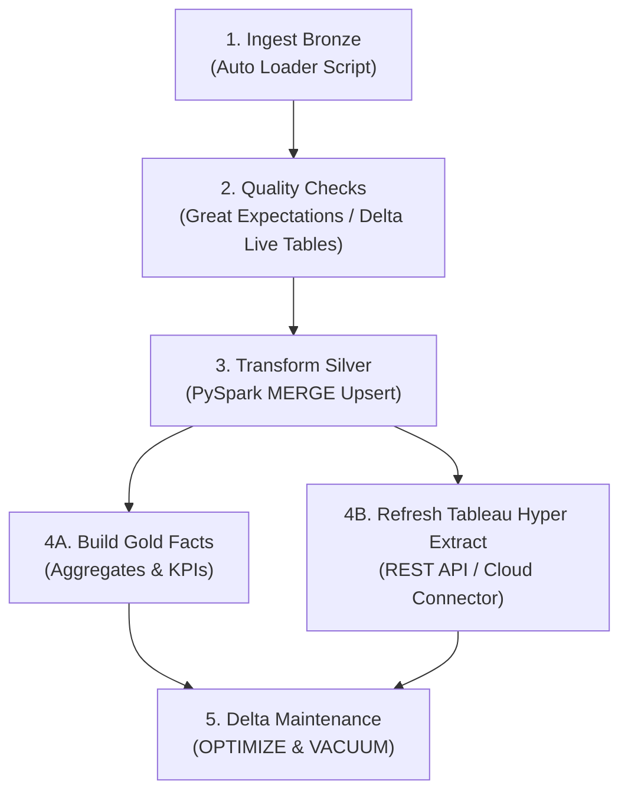

# Databricks ETL Pipelines: Building Resilient Lakehouse Architectures with PySpark and Delta Lake

**Difficulty:** Advanced | **Read Time:** 16 min | **Status:** Published | **Category:** Databricks / Analytics Engineering

---

## 1. Introduction: From Fragile Data Lakes to Governed Lakehouses

Traditional cloud data lakes on object stores like Amazon S3 and Azure Blob Storage frequently suffer from reliability issues: partial file writes during job failures, dirty reads during concurrent writes, lack of schema enforcement, and slow metadata lookups over millions of small files.

The **Databricks Lakehouse architecture** solves these limitations by layering the **Delta Lake open table format** over cloud storage. Delta Lake brings ACID transactions, unified streaming and batch processing, automatic metadata indexing, and time travel to Apache Spark.

In this guide, we walk through building production-grade ETL pipelines on Databricks:
1. Ingesting raw landing files incrementally using **Databricks Auto Loader (`cloudFiles`)**.
2. Applying medallion architecture transformations (Bronze to Silver to Gold) with **PySpark**.
3. Enforcing schema evolution and ACID guarantees with **Delta Lake**.
4. Eliminating small file bottlenecks with **Delta Auto Compaction, OPTIMIZE, and Z-ORDER**.
5. Orchestrating multi-task dependency DAGs with **Databricks Workflows**.

---

## 2. Lakehouse Architecture: The Medallion Paradigm

The medallion architecture organizes data into three distinct quality and refinement zones:

```mermaid
flowchart LR
    subgraph Landing["1. Ingestion / Landing"]
        S3Raw["Raw File Drops<br/>(JSON, CSV, Parquet)"]
    end

    subgraph Bronze["2. Bronze Layer (Raw Ingest)"]
        AutoLoader["Auto Loader Stream<br/>(cloudFiles)"]
        BronzeDelta["Bronze Delta Table<br/>(Append-only, Schema Log)"]
    end

    subgraph Silver["3. Silver Layer (Cleansed & Conformed)"]
        PySparkTransform["PySpark Deduplication<br/>& Business Validation"]
        SilverDelta["Silver Delta Table<br/>(SCD Type 1/2, MERGE INTO)"]
    end

    subgraph Gold["4. Gold Layer (Business Aggregates)"]
        GoldAgg["Dimension & Fact Marts<br/>(Optimized & Z-Ordered)"]
        BIViews["Tableau / Power BI<br/>Live SQL Queries"]
    end

    S3Raw --> AutoLoader
    AutoLoader --> BronzeDelta
    BronzeDelta --> PySparkTransform
    PySparkTransform --> SilverDelta
    SilverDelta --> GoldAgg
    GoldAgg --> BIViews
```



* **Bronze (Raw Ingest):** Raw data appended directly from source files with minimal processing. Preserves the full payload history, metadata timestamps, and input file names for traceability.
* **Silver (Conformed & Cleansed):** Data is parsed, validated, deduplicated, and conformed into normalized tables. Invalid records are quarantined, nulls are sanitized, and dimensions are maintained using `MERGE INTO` statements.
* **Gold (Business Aggregates):** Curated dimensional models (star/snowflake schemas) and aggregate summary tables formatted specifically for high-concurrency BI reporting in Tableau and Power BI.

---

## 3. Incremental File Ingestion with Auto Loader (`cloudFiles`)

Processing file drops incrementally using scheduled batch directory scans becomes prohibitively slow when directories contain hundreds of thousands of files. **Databricks Auto Loader** processes millions of incoming files with low latency by leveraging cloud file notification services (AWS SQS / Azure Event Grid) or directory listing mode.

### Auto Loader PySpark Implementation

```python
from pyspark.sql import functions as F
from pyspark.sql.types import StructType, StructField, StringType, DoubleType, TimestampType

# Define expected schema with room for schema evolution
schema = StructType([
    StructField("transaction_id", StringType(), False),
    StructField("customer_id", StringType(), True),
    StructField("amount", DoubleType(), True),
    StructField("currency", StringType(), True),
    StructField("event_timestamp", TimestampType(), True)
])

# Stream configuration for raw landing zone
raw_landing_path = "s3://enterprise-lakehouse/landing/transactions/"
checkpoint_path = "s3://enterprise-lakehouse/checkpoints/bronze_transactions/"
bronze_table_path = "s3://enterprise-lakehouse/bronze/transactions/"

bronze_stream = (
    spark.readStream
    .format("cloudFiles")
    .option("cloudFiles.format", "json")
    .option("cloudFiles.schemaLocation", f"{checkpoint_path}/schema")
    .option("cloudFiles.inferColumnTypes", "true")
    .option("cloudFiles.schemaEvolutionMode", "addNewColumns")
    .schema(schema)
    .load(raw_landing_path)
    .withColumn("_ingest_timestamp", F.current_timestamp())
    .withColumn("_source_file", F.input_file_name())
    .writeStream
    .format("delta")
    .outputMode("append")
    .option("checkpointLocation", checkpoint_path)
    .trigger(availableNow=True) # Runs in cost-efficient micro-batch mode
    .toTable("bronze.transactions")
)
```

### Key Engineering Decisions:
* **`cloudFiles.schemaEvolutionMode = 'addNewColumns'`**: Automatically captures new incoming JSON attributes without failing the ETL pipeline.
* **`trigger(availableNow=True)`**: Replaces legacy `trigger(once=True)` by processing all pending data in multiple optimized micro-batches before shutting down compute clusters, preventing out-of-memory errors on large backlog drops.

---

## 4. Conforming Silver Tables with Delta `MERGE INTO` (Upserts)

To maintain current state in the Silver layer while avoiding duplicates from re-ingested data, Delta Lake provides full ACID support for the SQL `MERGE INTO` command.

```sql
MERGE INTO silver.customers AS target
USING (
  SELECT 
    customer_id,
    first_name,
    last_name,
    email,
    region,
    account_status,
    event_timestamp,
    ROW_NUMBER() OVER (
      PARTITION BY customer_id 
      ORDER BY event_timestamp DESC
    ) AS row_num
  FROM bronze.customers_stream
  WHERE customer_id IS NOT NULL
) AS source
ON target.customer_id = source.customer_id AND source.row_num = 1

WHEN MATCHED AND source.event_timestamp > target.last_updated THEN
  UPDATE SET
    target.first_name = source.first_name,
    target.last_name = source.last_name,
    target.email = source.email,
    target.region = source.region,
    target.account_status = source.account_status,
    target.last_updated = source.event_timestamp

WHEN NOT MATCHED THEN
  INSERT (
    customer_id,
    first_name,
    last_name,
    email,
    region,
    account_status,
    last_updated,
    created_at
  ) VALUES (
    source.customer_id,
    source.first_name,
    source.last_name,
    source.email,
    source.region,
    source.account_status,
    source.event_timestamp,
    current_timestamp()
  );
```

---

## 5. Eliminating Performance Bottlenecks in PySpark

When scaling PySpark pipelines to billions of rows, unoptimized joins and data shuffling create severe execution bottlenecks. Here are the core optimization rules:

### A. Broadcast Joins for Asymmetric Datasets
When joining large transaction facts with smaller lookup tables (e.g. dimension tables under 50 MB), prevent expensive cluster-wide network shuffles by broadcasting the small table to all worker nodes:

```python
from pyspark.sql.functions import broadcast

# Standard join triggers shuffle of both large and small tables across cluster
# Broadcast join distributes small dimension table in memory across workers
df_enriched = df_large_transactions.join(
    broadcast(df_store_dimension),
    df_large_transactions.store_id == df_store_dimension.store_id,
    "inner"
)
```

### B. Delta Table Compaction and Z-Ordering
Frequent streaming writes produce hundreds of small 5 to 10 MB files. Small files degrade query planning and scan times. Run scheduled compaction and multi-dimensional clustering on frequently filtered columns:

```sql
-- Compact small files into uniform 1 GB Parquet blocks
OPTIMIZE gold.fact_sales
ZORDER BY (sale_date, store_id, customer_region);
```

> **Performance Impact:** Z-Ordering clusters related records along multiple dimensions, allowing Databricks query engines to skip up to 90% of file blocks via column min/max statistics during Tableau live queries.

---

## 6. Pipeline Orchestration with Databricks Workflows

Databricks Workflows provides serverless, enterprise-grade DAG scheduling, parameter sharing, and automatic retries without requiring external Airflow infrastructure.



### Task Value Sharing Example:
```python
# Task 1: Store processed batch timestamp in execution context
dbutils.jobs.taskValues.set(key="latest_batch_id", value="2026-08-08-B001")

# Task 2: Retrieve batch ID to ensure cross-task deterministic filtering
batch_id = dbutils.jobs.taskValues.get(taskKey="ingest_bronze", key="latest_batch_id")
print(f"Executing Silver transform for batch: {batch_id}")
```

---

## 7. Summary & Architectural Checklist

| Architectural Layer | Component | Production Best Practice |
|---|---|---|
| **Landing → Bronze** | Auto Loader (`cloudFiles`) | Use `availableNow=True` micro-batching with schema evolution enabled |
| **Bronze → Silver** | Delta Lake `MERGE INTO` | Deduplicate on composite business keys before executing upserts |
| **Silver → Gold** | PySpark & SQL Marts | Broadcast dimension joins; cluster fact tables via `OPTIMIZE ZORDER BY` |
| **Storage Hygiene** | Delta Maintenance | Run weekly `VACUUM` retaining 7 to 14 days of historical transaction logs |
| **Orchestration** | Databricks Workflows | Parameterize environments (Dev, Staging, Prod) using job task values |

---

## 8. Related Engineering Guides
* [Tableau Performance Tuning: Building Dashboards That Load Under 2 Seconds](#/insights/tableau-performance-tuning)
* [Amazon Athena Query Optimization at Scale](#/insights/athena-optimization)
* [Row-Level Security & Entitlement Architecture](#/insights/enterprise-rls)
* [SQL Performance Tuning & Execution Plan Mastery](#/insights/sql-performance)
