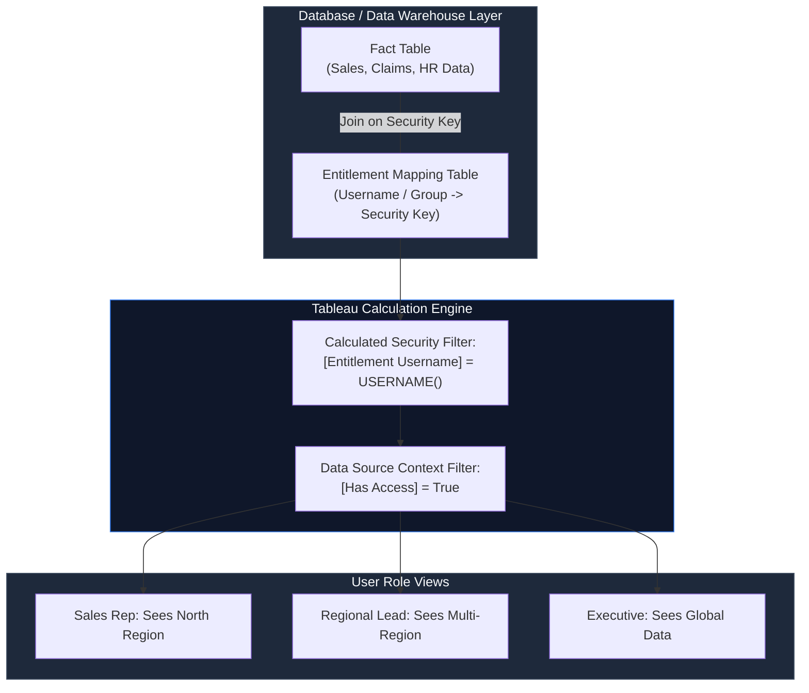

# Row-Level Security in Tableau: Enterprise Data Entitlements Guide

If you have ever needed to publish a single dashboard where a sales rep sees only their own region, a claims manager sees only their line of business, and a VP sees everything, you have needed Row-Level Security (RLS). It is one of those Tableau capabilities that looks simple in a demo and gets genuinely tricky the moment real users, real groups, and real performance requirements show up.

This guide walks through what RLS actually is, the main ways to implement it in Tableau, how to test it properly, and the architectural mistakes that most commonly break it in production.

---

## Overview & Architecture



---

## What Row-Level Security Actually Means

RLS restricts the *rows* a user can see in a data source: not the fields, not the dashboard layout, but the underlying data rows. Two users opening the exact same dashboard, built from the exact same data source, see completely different data based on their identity and entitlements.

> [!NOTE]
> **RLS is distinct from Permissions and Column-Level Security:**
> * **Permissions**: Governs whether a user can open, edit, or download a workbook or data source.
> * **Column-Level Security**: Hides specific sensitive fields (e.g., SSN, Salary) from certain roles. Tableau does not natively support column-level security in a single data source; it is typically handled via separate published data sources or secure database views.
> * **Row-Level Security**: Dynamically filters row records based on user identity (`USERNAME()`, `FULLNAME()`, or `ISMEMBER()`).

---

## Why It Matters

The legacy alternative to RLS is creating separate copies of the same dashboard for different teams, or manually filtering and re-publishing every time an organization changes. That approach does not scale and introduces severe governance risk: someone eventually forgets to update a filter, leading to data leaks.

In regulated industries such as financial services, insurance, and healthcare, unauthorized data exposure is a major compliance violation. RLS allows teams to publish once while security enforcement travels with the data model itself.

---

## The 4 Main Approaches

| Approach | Scales Well? | Maintenance Owner | Works with Extracts? |
| :--- | :--- | :--- | :--- |
| **1. Manual User Filters** | No | Workbook Author | Yes |
| **2. Entitlement Table + Calc Field** | Yes | Analyst / BI Developer | Yes |
| **3. ISMEMBER() + Server Groups** | Yes (for group-level access) | Analyst + Server Admin | Yes |
| **4. Database-Level RLS Pushdown** | Yes (enterprise scale) | DBA / Data Platform Team | Live Connections Only |

### 1. Manual User Filters
Tableau allows creators to set manual user filters via **Edit Filter → Show Filter for Selected Users**. While quick for a proof of concept, it does not scale. Every new employee requires a manual workbook edit and republication. Avoid this for production workflows.

### 2. Entitlement Table + Calculated Field (Standard Enterprise Pattern)
This is the most flexible production pattern. You maintain a security mapping table (an entitlement table) that maps users or groups to dimension values.

```text
Entitlement Table
----------------------------------
username        | region_code
----------------------------------
priya.k         | NORTH
priya.k         | EAST
arjun.m         | SOUTH
manager.rao     | ALL
```

Join this table to your transaction fact table, then implement an access calculation:

```tableau
// Calculated Field: [Has Access]
[Entitlement Username] = USERNAME() OR [Entitlement Username] = 'ALL'
```

Applying `[Has Access] = True` at the Data Source Filter level ensures that every worksheet automatically inherits the restriction.

### 3. ISMEMBER() with Tableau Server / Cloud Groups
When access aligns cleanly with Active Directory or SAML groups, `ISMEMBER()` avoids extra table joins:

```tableau
IF ISMEMBER('North_Region_Group') THEN [Region] = "North"
ELSEIF ISMEMBER('South_Region_Group') THEN [Region] = "South"
ELSE FALSE
END
```

> [!TIP]
> `ISMEMBER()` works well when access maps 1:1 to corporate roles. However, if entitlements are granular (e.g., specific account combinations across multiple territories), entitlement mapping tables are much easier to maintain than nested `IF/ELSE` statements.

### 4. Database-Level Security Pushdown
For enterprise warehouses (Snowflake Row Access Policies, PostgreSQL RLS, AWS Redshift Security Predicates), security logic resides directly inside the database engine. Tableau passes the user identity via impersonation or session parameters, and the warehouse returns only authorized rows.

> [!IMPORTANT]
> Database-level RLS requires live queries. If data is extracted into a Hyper extract file without pre-filtering, database-level security is lost unless user-specific extracts or virtual connections are configured.

---

## Step-by-Step Entitlement Table Implementation

1. **Build a Governed Entitlement Table**: Store one row per entitlement mapping (`username`, `dimension_key`). Keep this table in a database, not an unmanaged spreadsheet.
2. **Join to Fact Data**: Perform an inner or left join between your fact table and entitlement mapping table on the shared business key (e.g., `Region_ID`, `Department_Code`).
3. **Create the Calculated Security Filter**:
   ```tableau
   // [Security Filter]
   [Entitlement_Username] = USERNAME()
   ```
4. **Apply as a Data Source Filter**: Right-click the Data Source → **Edit Data Source Filters** → Add `[Security Filter]` set to `True`.
5. **Promote Filter to Context**: Add the security filter to context so Tableau evaluates it before fixed LOD calculations and dimension filters.

---

## Testing & Verification: Using "View As"

Never test RLS by asking business users if they can see their data. Tableau Server and Cloud provide a built-in **"View As"** feature for Administrators:

1. Open the published dashboard on Tableau Server/Cloud.
2. Click the **View As** button in the top toolbar.
3. Select any user or group to render the dashboard under their exact security context.

> [!TIP]
> **Verification Checklist:**
> * **Unmapped Users**: Confirm that users omitted from the entitlement table see zero records rather than unfiltered data.
> * **Multi-Role Users**: Ensure users mapped to multiple regions see the complete union of their entitlements.
> * **LOD Behavior**: Verify that `{FIXED}` LOD expressions do not bypass RLS filters (ensure RLS filters are in Context).

---

## Performance Considerations

Because RLS filters execute on every query, unoptimized calculations can degrade dashboard load times:

* **Prefer Joins over Blends**: Data blending enforces RLS post-aggregation, which can cause significant performance bottlenecks on large datasets.
* **Avoid Complex LODs inside RLS Calcs**: Simple boolean expressions (`[User] = USERNAME()`) execute far faster than complex nested LOD expressions.
* **Indexing Security Keys**: Ensure the join keys between fact and entitlement tables are properly indexed in live database connections.

---

## Common Pitfalls

* **Sheet-Level Filter Omission**: Applying RLS filters to individual worksheets instead of the Data Source level creates risk if a creator adds a new sheet and forgets the filter.
* **Secondary Data Source Leakage**: In multi-data-source workbooks, applying RLS to Data Source A while leaving Data Source B unfiltered exposes sensitive data.
* **Extract Refresh Staleness**: If user access changes in Active Directory, ensure extract refresh schedules sync promptly to avoid stale permissions.

---

## Governance & Audit Readiness

The calculated field is only one piece of the security model. Complete audit readiness requires documenting:

1. **Entitlement Ownership**: Who approves access updates in the mapping table.
2. **Sync Automation**: How Active Directory / SAML identity updates propagate to database entitlement tables.
3. **Periodic Access Reviews**: Regular automated checks against Tableau PostgreSQL Repository data to verify entitlement validity.

---

## Back to Insights
[Return to Insights](#/insights)
