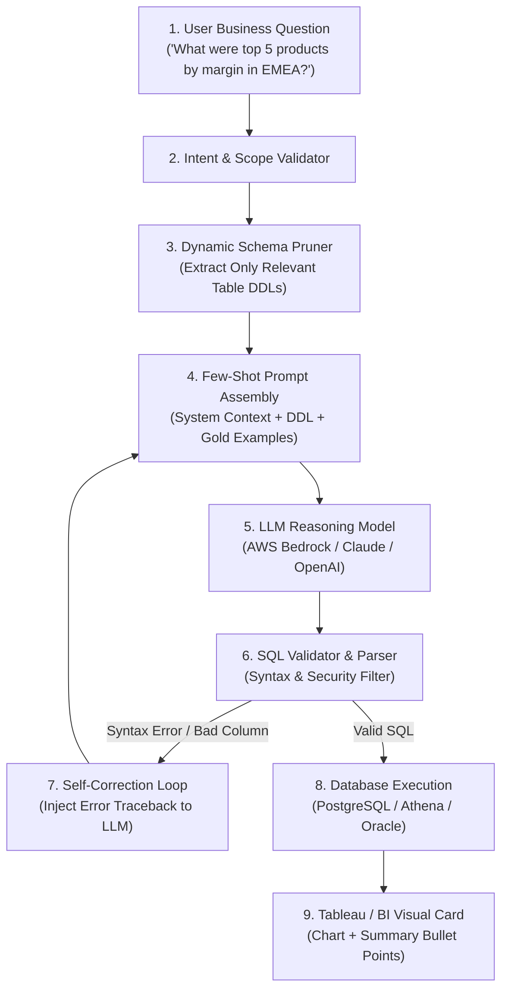

# Prompt Engineering for BI: Context Injection, Few-Shot SQL Generation, and Self-Correction Loops

**Difficulty:** Advanced | **Read Time:** 14 min | **Status:** Published | **Category:** Artificial Intelligence / Conversational BI

---

## 1. The Challenge of Text-to-SQL in Enterprise Analytics

Integrating Large Language Models (LLMs) such as Anthropic Claude, OpenAI GPT-4, and Amazon Bedrock with enterprise analytics databases introduces critical engineering challenges:

1. **Hallucination of Column Names:** LLMs invent non-existent table attributes or misinterpret ambiguous business terms (e.g. confusing `gross_sales` with `net_revenue`).
2. **Dialect-Specific Syntax Errors:** Generic prompts generate incompatible SQL (e.g. using `DATEADD` in PostgreSQL or `ILIKE` in Oracle).
3. **Token Limit Constraints:** Injecting complete corporate data dictionaries with hundreds of tables and columns exhausts token limits and increases API latency.
4. **Security & Data Exfiltration:** Passing raw enterprise data records into third-party LLM endpoints violates compliance policies.

This guide outlines a production-proven architecture for **metadata-only schema injection, few-shot prompt structuring, and autonomous self-correction loops**.

---

## 2. Text-to-SQL Autonomous Agent Workflow



---

## 3. Dynamic Schema Pruning & Context Injection

Never pass full database schemas into the LLM system prompt. Instead, build a lightweight keyword or vector retrieval index over table metadata to inject only the relevant table DDL definitions.

### Production System Prompt Template

```markdown
# ROLE AND OBJECTIVE
You are an expert Senior Analytics Engineer specializing in PostgreSQL 15 SQL generation.
Generate ONLY valid, executable SELECT queries. Never generate INSERT, UPDATE, DELETE, DROP, or ALTER statements.

# TARGET DATABASE SCHEMA
TABLE: fact_sales
- sale_id (VARCHAR, PRIMARY KEY)
- customer_id (VARCHAR, FK to dim_customers)
- product_id (VARCHAR, FK to dim_products)
- sale_date (DATE, Format: YYYY-MM-DD)
- quantity (INTEGER)
- gross_amount (NUMERIC(12,2))
- discount_amount (NUMERIC(12,2))
- net_revenue (NUMERIC(12,2)) -- Formula: gross_amount - discount_amount

TABLE: dim_products
- product_id (VARCHAR, PRIMARY KEY)
- product_name (VARCHAR)
- category (VARCHAR) -- Values: 'Electronics', 'Home Goods', 'Apparel'
- unit_cost (NUMERIC(10,2))

# STRICT BUSINESS LOGIC RULES
1. Margin is calculated as: SUM(s.net_revenue) - SUM(p.unit_cost * s.quantity)
2. Always filter by `sale_date >= CURRENT_DATE - INTERVAL '1 year'` unless an explicit date range is specified by the user.
3. Always wrap column aliases with double quotes if they contain spaces.
4. Output your response strictly as JSON matching the schema below:
{
  "sql": "SELECT ...",
  "explanation": "Short 1-sentence description of the metric",
  "visual_recommendation": "bar_chart | line_chart | table"
}
```

---

## 4. Few-Shot Demonstration Anchoring

Few-shot examples anchor the LLM to specific architectural patterns, complex window functions, and corporate business definitions.

### Example Few-Shot Pair

```json
[
  {
    "user_query": "Compare month-over-month sales growth between regions for 2026",
    "assistant_response": {
      "sql": "WITH monthly_regional_sales AS (\n  SELECT \n    region,\n    DATE_TRUNC('month', sale_date) AS sale_month,\n    SUM(net_revenue) AS total_revenue,\n    LAG(SUM(net_revenue)) OVER (\n      PARTITION BY region \n      ORDER BY DATE_TRUNC('month', sale_date)\n    ) AS prior_month_revenue\n  FROM fact_sales\n  WHERE sale_date >= '2026-01-01' AND sale_date <= '2026-12-31'\n  GROUP BY region, DATE_TRUNC('month', sale_date)\n)\nSELECT \n  region,\n  sale_month,\n  total_revenue,\n  prior_month_revenue,\n  ROUND(\n    ((total_revenue - prior_month_revenue) / NULLIF(prior_month_revenue, 0)) * 100.0, \n    2\n  ) AS mom_growth_pct\nFROM monthly_regional_sales\nORDER BY region, sale_month;",
      "explanation": "Calculates monthly net revenue and percentage month-over-month growth by region using window functions.",
      "visual_recommendation": "line_chart"
    }
  }
]
```

---

## 5. Automated Self-Correction Loop Implementation

When the database engine returns a syntax or semantic error (such as a misspelled column or mismatched join data type), intercept the traceback and feed it back into the model in a closed loop (maximum 3 retry attempts):

```python
import json
import psycopg2
from typing import Dict, Any

def execute_with_self_correction(user_question: str, db_connection, llm_client, max_retries: int = 3) -> Dict[str, Any]:
    history = []
    
    for attempt in range(1, max_retries + 1):
        # Generate SQL from LLM
        response = llm_client.generate_sql(
            question=user_question,
            error_history=history
        )
        sql_query = response.get("sql")
        
        try:
            # Validate SQL against live database cursor with read-only sandbox role
            cursor = db_connection.cursor()
            cursor.execute("SET TRANSACTION READ ONLY;")
            cursor.execute(f"EXPLAIN {sql_query}") # Validate execution plan before running
            cursor.execute(sql_query)
            rows = cursor.fetchall()
            
            return {
                "status": "success",
                "attempts": attempt,
                "sql": sql_query,
                "data": rows,
                "explanation": response.get("explanation")
            }
            
        except psycopg2.Error as e:
            # Capture specific database error message
            error_msg = str(e).strip()
            db_connection.rollback()
            
            # Append feedback to error history for self-correction in next loop
            history.append({
                "attempt": attempt,
                "failed_sql": sql_query,
                "database_error": error_msg
            })
            
    return {
        "status": "failed",
        "error": "Exceeded maximum self-correction retry limits.",
        "history": history
    }
```

---

## 6. Enterprise Guardrails & Security Best Practices

| Category | Security Vulnerability | Enterprise Mitigation Strategy |
|---|---|---|
| **SQL Injection** | Malicious injection strings in prompt | Enforce read-only database user roles; parse AST with `sqlglot` before execution |
| **Data Privacy** | Exposing PII (Personal Identifiable Information) | Send only structural table DDLs to the LLM API; never include actual row data |
| **Compute Denial of Service** | Unbounded cartesian joins or `SELECT *` | Set query timeout to 5 seconds and wrap every query with `LIMIT 500` |
| **Hallucination Rate** | Inventing non-existent column metrics | Use strict few-shot examples and schema-grounding rules |

---

## 7. Related Engineering Guides
* [AI in Tableau: Bedrock & LangChain Integration](#/insights/ai-in-tableau)
* [SQL Performance Tuning & Execution Plan Mastery](#/insights/sql-performance)
* [Tableau Performance Tuning: Building Dashboards That Load Under 2 Seconds](#/insights/tableau-performance-tuning)
* [Row-Level Security & Entitlement Architecture](#/insights/enterprise-rls)
