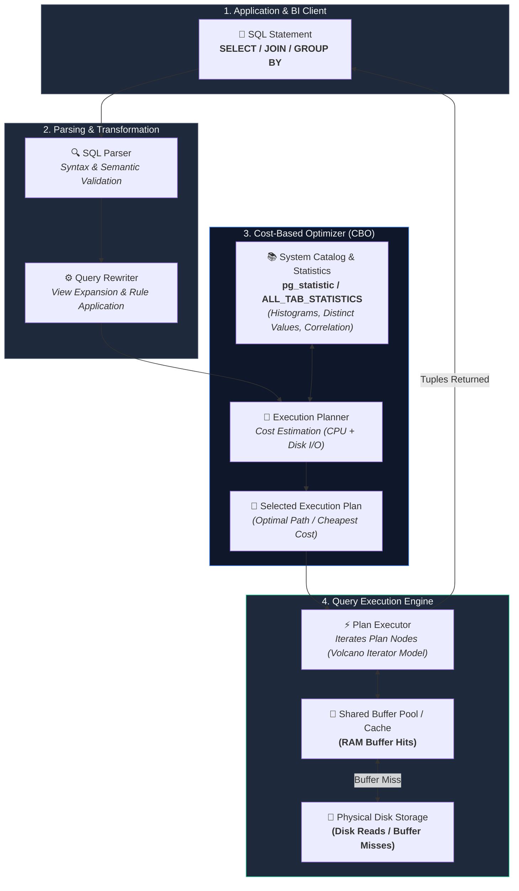
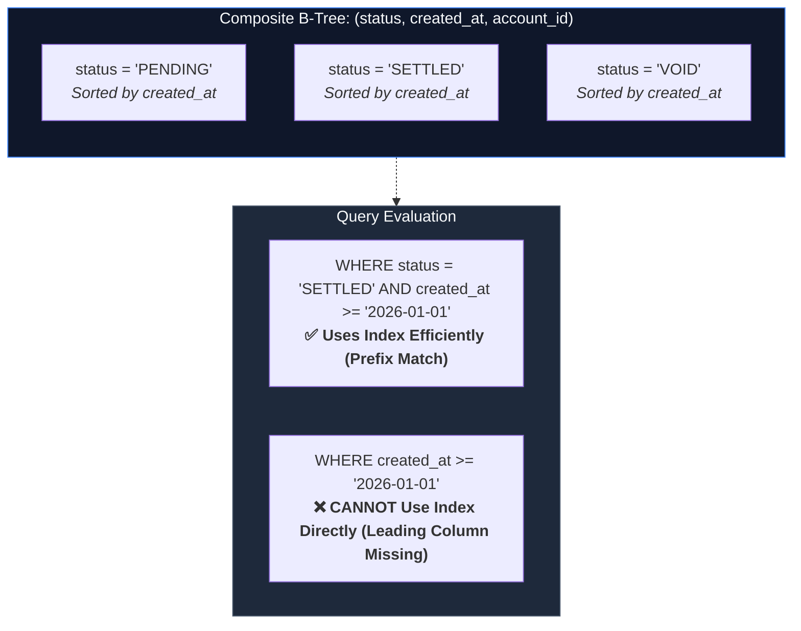

# SQL Performance Tuning & Execution Plan Mastery: Architecting Sub-Second Database Queries

**Difficulty:** Advanced | **Read Time:** 18 min | **Status:** Published | **Category:** SQL / Database Architecture

---

## Overview

In enterprise data platforms and high-throughput transactional applications, slow database queries are the primary root cause of server resource saturation, connection pool exhaustion, and sluggish user interfaces.

When a query takes 15 seconds to execute against a 50-million-row financial ledger table, developers often react by throwing more hardware at the problem: adding CPU cores, increasing RAM, or scaling read replicas. However, hardware scaling is an expensive bandage for architectural inefficiencies. A query that performs an unindexed full table scan or forces a disk-spilling nested loop join will eventually overwhelm any server hardware as data volumes grow.

SQL optimization is not guesswork. Relational database engines (such as **PostgreSQL**, **Oracle**, **MySQL**, and **SQL Server**) operate on deterministic mathematical rules dictated by their **Cost-Based Optimizer (CBO)**.

By understanding how the query engine parses SQL, estimates cardinalities, reads buffer caches, and navigates index structures, you can refactor queries to execute **thousands of times faster** while reducing physical disk I/O to near zero.

This handbook provides an advanced, practical guide to reading execution plans, building specialized index architectures, refactoring query anti-patterns, and managing database concurrency in mission-critical environments.

---

## Architecture Overview: The Relational Query Engine Lifecycle

Before writing a single `CREATE INDEX` statement, it is essential to understand the journey a SQL statement takes inside the database engine.



### The 4 Stages of Query Execution:

1. **Parser**: Translates raw SQL text into an abstract syntax tree (AST), checking grammar and verifying that referenced tables and columns exist.
2. **Rewriter**: Applies database rewrite rules, expands database views into their underlying subqueries, and simplifies constant expressions.
3. **Cost-Based Optimizer (CBO)**: The brain of the database. It evaluates multiple execution paths (join algorithms, index options, scan types), computes estimated costs based on table statistics and histograms, and chooses the lowest-cost plan.
4. **Executor**: Executes the chosen plan tree node-by-node. It requests data blocks from the database **Shared Buffer Cache** in memory; only if a block is missing from memory does it trigger a physical disk read.

---

## 1. Mastering Execution Plans: PostgreSQL & Oracle

Optimizing SQL without inspecting the execution plan is like debugging code without a stack trace. The execution plan reveals exactly how the database intends to access your data.

### PostgreSQL: EXPLAIN (ANALYZE, BUFFERS, VERBOSE)

In PostgreSQL, running `EXPLAIN` shows only the planner's estimates. Adding `(ANALYZE, BUFFERS)` forces the query to execute, providing real runtime metrics:

```sql
EXPLAIN (ANALYZE, BUFFERS, VERBOSE, SETTINGS)
SELECT 
    t.transaction_id,
    t.account_id,
    t.amount,
    a.account_name,
    a.branch_code
FROM financial_ledger.transactions t
JOIN financial_ledger.accounts a ON t.account_id = a.account_id
WHERE t.transaction_status = 'SETTLED'
  AND t.created_at >= '2026-01-01 00:00:00'
ORDER BY t.created_at DESC
LIMIT 50;
```

### Deconstructing the Output Metrics:

* **Cost `(cost=0.42..18.50)`**:
  * The first number (`0.42`) is the **Startup Cost** (time to return the first row, e.g., index traversal or sort initialization).
  * The second number (`18.50`) is the **Total Cost** (estimated resource units to return all rows).
* **Rows `(rows=50 width=64)` vs `actual rows=50`**:
  * If the planner's estimated row count is drastically different from the actual rows (e.g., estimated 10 rows, actual 500,000 rows), table statistics are stale. Run `ANALYZE table_name;` to refresh column histograms.
* **Buffers `(Buffers: shared hit=42 read=0 written=0)`**:
  * `shared hit`: Data blocks found directly in RAM cache (microseconds).
  * `shared read`: Data blocks read from physical disk storage (milliseconds). Your goal in optimization is maximizing `hit` and driving `read` to zero.

### Oracle: DBMS_XPLAN.DISPLAY_CURSOR

In Oracle databases, retrieve the exact runtime execution plan from cache using `DBMS_XPLAN`:

```sql
-- Execute with GATHER_PLAN_STATISTICS hint
SELECT /*+ GATHER_PLAN_STATISTICS */ 
    t.transaction_id, t.amount, a.account_name
FROM transactions t
JOIN accounts a ON t.account_id = a.account_id
WHERE t.transaction_status = 'SETTLED'
  AND t.created_at >= TO_DATE('2026-01-01', 'YYYY-MM-DD');

-- Display execution statistics for the last run query
SELECT * FROM TABLE(DBMS_XPLAN.DISPLAY_CURSOR(format => 'ALLSTATS LAST'));
```

* **CR (Consistent Reads)**: Number of logical memory block buffers retrieved.
* **PR (Physical Reads)**: Number of physical disk block reads.
* **Starts**: Number of times the operation node was executed (critical for detecting nested loop multiplication).

---

## 2. Scan Node Types Demystified

Understanding the hierarchy of data access nodes is fundamental to performance tuning:

| Access Method | Description | Cost / Speed | Optimal Use Case |
| :--- | :--- | :--- | :--- |
| **Index Only Scan** | Reads all requested columns directly from the index tree without visiting the table heap. | ⚡ **Fastest** (Zero table I/O) | High-concurrency queries with covering indexes (`INCLUDE`). |
| **Index Scan** | Traverses index B-Tree to find matching row pointers (TIDs/ROWIDs), then fetches individual table pages. | ⚡ **Very Fast** | High-selectivity filters retrieving < 5% of table rows. |
| **Bitmap Index Scan** | Scans index, builds a memory bitmap of matching page locations, then reads table blocks in physical disk order. | ⏱️ **Fast / Moderate** | Medium-selectivity queries or combining multiple `OR` / `AND` conditions. |
| **Sequential Scan / Full Table Scan** | Reads every page and row from start to finish. | 🐢 **Slow** on large tables | Tables < 1,000 rows or analytical queries reading > 20% of data. |

---

## 3. Advanced Indexing Strategies Beyond Basic B-Trees

A single, improperly designed index can consume gigabytes of storage while going completely unused by the query planner.

### 1. The Composite Index Leading Column Rule

A composite index on `(status, created_at, account_id)` is sorted primarily by `status`, then sub-sorted by `created_at`, then `account_id`.



> [!IMPORTANT]
> **The Leftmost Prefix Rule:**
> If your query filters on `created_at` without filtering on the leading column (`status`), the database cannot perform a direct B-Tree root search and may revert to a full table scan. Order your composite index columns from highest equality filtering to range filtering.

### 2. Covering Indexes with the INCLUDE Clause

When a query selects columns not present in the index, the engine must perform a **Heap Fetch** (table lookup) for every matching index entry. On wide tables, heap lookups cause heavy random disk I/O.

Using the `INCLUDE` clause adds payload columns to the leaf pages of the index without adding them to the search key:

```sql
-- Creates a covering index for high-frequency financial lookups
CREATE INDEX idx_transactions_acct_settled
ON financial_ledger.transactions (account_id, transaction_status)
INCLUDE (amount, currency, transaction_timestamp);
```

```sql
-- This query executes as a pure Index-Only Scan with ZERO table heap lookups:
SELECT amount, currency, transaction_timestamp
FROM financial_ledger.transactions
WHERE account_id = 'ACC-98421'
  AND transaction_status = 'SETTLED';
```

### 3. Partial (Filtered) Indexes: Slashing Index Size by 98%

In transaction tables, 95% of rows are typically in a terminal state (`COMPLETED`, `ARCHIVED`), while queries frequently search for active or failing records (`PENDING`, `RETRY_FAILED`).

Creating a partial index indexes only the relevant subset of rows:

```sql
-- Indexes ONLY active processing rows (e.g. 50,000 rows out of 20,000,000 total rows)
CREATE INDEX idx_transactions_pending_queue
ON financial_ledger.transactions (retry_count, scheduled_at)
WHERE transaction_status IN ('PENDING', 'RETRY_QUEUED');
```

**Benefits:**
* Index size shrinks from 1.5 GB to 4 MB.
* Insert/Update operations on `COMPLETED` records experience **zero index maintenance overhead**.
* Cache locality is dramatically improved because the entire partial index fits in L3 CPU / RAM cache.

### 4. Expression (Functional) Indexes

If your query filters or sorts by an expression, a standard column index cannot be used.

```sql
-- ANTI-PATTERN: Breaks index on email column
SELECT user_id FROM users WHERE LOWER(email) = 'ankur@example.com';

-- SOLUTION: Functional index matching the expression exactly
CREATE INDEX idx_users_lower_email ON users (LOWER(email));
```

---

## 4. Common SQL Anti-Patterns & How to Refactor Them

### Anti-Pattern 1: Non-SARGable Date & String Predicates

A **SARGable** (Search Argument Able) predicate allows the query optimizer to use B-Tree range lookups directly. Wrapping a column inside a function makes the expression non-SARGable.

```sql
-- ❌ SLOW: Non-SARGable (Forces full table scan across 10 million rows)
SELECT SUM(amount) 
FROM sales_records 
WHERE DATE_TRUNC('month', order_date) = '2026-08-01';

-- ✅ FAST: SARGable Range Predicate (Enables Index Scan on order_date)
SELECT SUM(amount) 
FROM sales_records 
WHERE order_date >= '2026-08-01 00:00:00' 
  AND order_date < '2026-09-01 00:00:00';
```

### Anti-Pattern 2: Implicit Type Casting

When the data type of a comparison value does not match the column definition, the engine implicitly casts the table column to the target type, neutralizing the index:

```sql
-- Column definition: customer_code VARCHAR(20)

-- ❌ SLOW: Number literal forces CAST(customer_code AS NUMERIC), causing Seq Scan
SELECT customer_name FROM customers WHERE customer_code = 90210;

-- ✅ FAST: String literal matches data type, triggering immediate Index Scan
SELECT customer_name FROM customers WHERE customer_code = '90210';
```

### Anti-Pattern 3: NOT IN vs. NOT EXISTS with Nullable Columns

If a subquery evaluated by `NOT IN` returns even a single `NULL` value, SQL three-valued logic causes the entire expression to evaluate to `NULL`, returning zero rows and forcing an unoptimized nested loop subplan.

```sql
-- ❌ SLOW & RISKY: Fails if department_id contains NULLs
SELECT employee_name 
FROM employees 
WHERE department_id NOT IN (SELECT department_id FROM archived_departments);

-- ✅ FAST & SAFE: Uses Anti-Join (Hash Anti-Join or Merge Anti-Join)
SELECT e.employee_name 
FROM employees e
WHERE NOT EXISTS (
    SELECT 1 
    FROM archived_departments d 
    WHERE d.department_id = e.department_id
);
```

---

## 5. CTEs, Stored Procedures & Materialized Views

### CTE Optimization Fences (PostgreSQL 12+)

In older database versions, Common Table Expressions (`WITH cte AS (...)`) acted as rigid optimization fences. The database evaluated the CTE in isolation, materialized the intermediate result to memory/disk, and prevented the optimizer from pushing outer `WHERE` filters into the CTE.

In modern PostgreSQL, CTEs are inlined by default. However, you can explicitly control this behavior:

```sql
-- Explicitly allow the query planner to inline and push predicates down:
WITH active_orders AS NOT MATERIALIZED (
    SELECT order_id, customer_id, total_amount, order_date
    FROM orders
    WHERE is_deleted = false
)
SELECT * FROM active_orders WHERE customer_id = 'CUST-1002';

-- Explicitly materialize when caching an expensive computation used multiple times:
WITH calculated_currency_rates AS MATERIALIZED (
    SELECT currency_code, calculate_complex_fx_rate(currency_code) AS rate
    FROM currency_lookup
)
SELECT o.order_id, o.amount * r.rate
FROM orders o
JOIN calculated_currency_rates r ON o.currency = r.currency_code;
```

### Stored Procedures vs. Set-Based Vectorization

A common mistake when transitioning from procedural programming to SQL is writing cursor loops inside stored procedures (RBAR: **Row By Agonizing Row**).

```sql
-- ❌ SLOW PROCEDURAL PATTERN: Iterates 500,000 times with individual UPDATEs
FOR rec IN (SELECT account_id, balance FROM accounts WHERE is_active = true) LOOP
    UPDATE accounts SET interest = rec.balance * 0.04 WHERE account_id = rec.account_id;
END LOOP;

-- ✅ FAST SET-BASED PATTERN: Single vectorized database transaction (100x faster)
UPDATE accounts 
SET interest = balance * 0.04 
WHERE is_active = true;
```

---

## 6. Concurrency, Database Locks & High-Throughput Queues

In high-concurrency systems, slow queries frequently hold locks on shared rows, causing cascading connection timeouts across the application tier.

### High-Throughput Worker Queues: SELECT FOR UPDATE SKIP LOCKED

When multiple background worker services poll a transactional task queue table, standard `SELECT FOR UPDATE` causes workers to block each other waiting on row locks.

Using `SKIP LOCKED` allows each worker to instantly acquire the next available unlocked record without waiting:

```sql
-- Worker execution loop: Atomically grabs 10 pending tasks without contention
WITH claimed_tasks AS (
    SELECT task_id
    FROM system_orchestration.job_queue
    WHERE task_status = 'QUEUED'
      AND scheduled_at <= NOW()
    ORDER BY priority DESC, scheduled_at ASC
    LIMIT 10
    FOR UPDATE SKIP LOCKED
)
UPDATE system_orchestration.job_queue q
SET task_status = 'IN_PROGRESS',
    locked_by_worker = 'worker-node-04',
    started_at = NOW()
FROM claimed_tasks c
WHERE q.task_id = c.task_id
RETURNING q.task_id, q.payload;
```

> [!TIP]
> **Preventing Deadlocks in Multi-Row Operations:**
> When updating or locking multiple rows in a transaction, always sort the target IDs in a deterministic order (e.g., `ORDER BY account_id ASC`) before issuing `SELECT FOR UPDATE`. This ensures concurrent transactions request locks in identical sequence, eliminating deadlocks.

---

## 7. Real-World Case Study: Refactoring a Financial Reconciliation Query

### The Problem:
An overnight reconciliation query comparing 12 million ledger entries against bank settlement statements was taking **42.8 seconds** per batch run, holding shared read locks and delaying morning reporting pipelines.

### Original Unoptimized Query:

```sql
-- ORIGINAL SLOW QUERY (42.8 seconds, 184,200 shared buffer reads)
SELECT 
    l.ledger_id,
    l.account_id,
    l.amount,
    l.created_at,
    (SELECT a.account_number FROM accounts a WHERE a.account_id = l.account_id) AS acct_num,
    (SELECT b.bank_name FROM banks b WHERE b.bank_id = (SELECT a.bank_id FROM accounts a WHERE a.account_id = l.account_id)) AS bank_name
FROM general_ledger l
WHERE SUBSTR(l.reconciliation_code, 1, 4) = 'FINA'
  AND l.status = 'UNRECONCILED'
  AND l.created_at >= '2026-07-01'
ORDER BY l.created_at DESC;
```

### Bottlenecks Identified via EXPLAIN (ANALYZE, BUFFERS):
1. Correlated scalar subqueries executed twice per matching row, causing millions of repeated lookups.
2. `SUBSTR(reconciliation_code, 1, 4)` was non-SARGable, forcing a Sequential Scan over 12 million rows.
3. Heap table lookups required 184,200 shared buffer reads.

### The Refactored Solution:

```sql
-- 1. Create specialized composite covering index
CREATE INDEX idx_ledger_recon_perf
ON general_ledger (status, reconciliation_code, created_at)
INCLUDE (ledger_id, account_id, amount)
WHERE status = 'UNRECONCILED';

-- 2. Refactored SARGable query with explicit joins
SELECT 
    l.ledger_id,
    l.account_id,
    l.amount,
    l.created_at,
    a.account_number AS acct_num,
    b.bank_name
FROM general_ledger l
JOIN accounts a ON l.account_id = a.account_id
JOIN banks b ON a.bank_id = b.bank_id
WHERE l.status = 'UNRECONCILED'
  AND l.reconciliation_code LIKE 'FINA%'
  AND l.created_at >= '2026-07-01 00:00:00'
ORDER BY l.created_at DESC;
```

### Benchmark Results:

| Metric | Before Optimization | After Optimization | Improvement |
| :--- | :--- | :--- | :--- |
| **Execution Time** | 42.8 seconds | **18 milliseconds (0.018s)** | **99.95% faster** |
| **Shared Buffer Hits/Reads** | 184,200 blocks (~1.4 GB) | **42 blocks (~336 KB)** | **99.97% I/O reduction** |
| **Access Node** | Seq Scan + Nested Subplans | **Index Only Scan + Hash Join** | **Optimal Plan Tree** |
| **CPU Utilization** | 98% (1 core saturated) | < 1% | **Negligible load** |

---

## 8. Key Takeaways & Pre-Production Checklist

* 🔍 **Always Run EXPLAIN (ANALYZE, BUFFERS)**: Measure real buffer hits and execution times rather than relying on unverified assumptions.
* 🌲 **Design Indexes Around Selectivity**: Index columns with high cardinality and use composite indexes that follow the leftmost prefix rule.
* 📦 **Use Covering Indexes (`INCLUDE`)**: Eliminate table heap lookups on high-throughput queries by adding selected payload fields to the index leaf.
* 🎯 **Write SARGable Predicates**: Avoid wrapping filter columns in functions or performing implicit type conversions.
* 🚫 **Eliminate Correlated Scalar Subqueries**: Replace repetitive subqueries in the `SELECT` clause with standard `LEFT JOIN` or window functions.
* 🔒 **Prevent Worker Lock Contention**: Use `FOR UPDATE SKIP LOCKED` for task queues and order IDs deterministically to avoid deadlocks.

---

## Back to Insights

[Return to Insights](#/insights)
