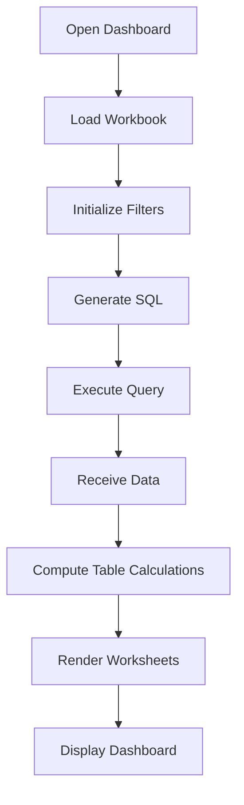
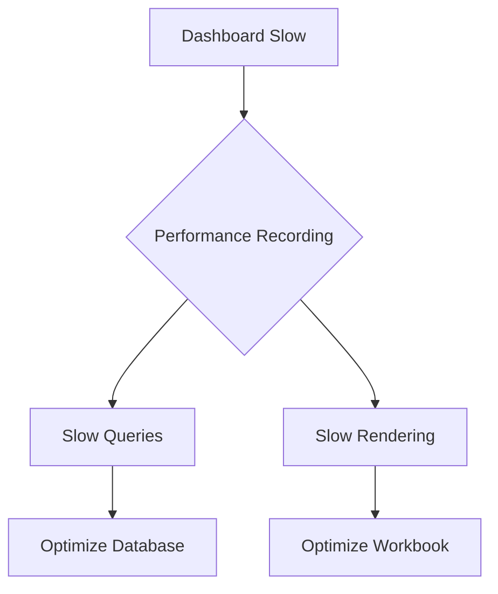
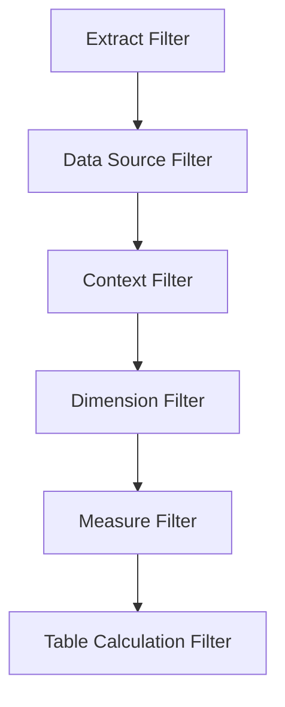

# Hero Section

Title: Tableau Performance Tuning: Building Dashboards That Load in Under 2 Seconds
Subtitle: Learn how to diagnose performance bottlenecks, optimize dashboard rendering, reduce query execution time, and build enterprise-grade Tableau dashboards that scale efficiently.
Reading Information:
• Advanced
• 15 min read
• Published July 2026

---

# Overview

In enterprise business intelligence (BI) environments, dashboard load speed is a direct driver of user adoption and data-driven decision-making. When a dashboard takes longer than a few seconds to load, users quickly lose focus, abandon the tool, and resort to outdated offline spreadsheets. Dashboard performance tuning is therefore not just a technical polish, but an essential step in ensuring business alignment and data trust.

A slow dashboard is rarely the result of a single issue; rather, it is a compounding effect of multiple inefficiencies. Inefficient database connections, bloated query sizes, poor calculation structures, and visual complexity all contribute to rendering delays. When scaled across an enterprise with hundreds of concurrent users, these bottlenecks translate to high server load and sluggish response times.

To build dashboards that consistently load in under 2 seconds, developers must move away from guessing and implement a structured optimization workflow. This guide outlines how to systematically analyze, optimize, and validate Tableau dashboard performance across the database, workbook, and presentation layers.

---

# Table of Contents

1. Why Tableau Dashboards Become Slow
2. Tableau Rendering Pipeline
3. Using Performance Recording
4. Database Bottlenecks
5. Rendering Bottlenecks
6. Live vs Extract
7. Custom SQL vs Database Views
8. Filter Optimization
9. LOD Optimization
10. Reducing Marks
11. Dashboard Design Best Practices
12. Performance Checklist
13. Real-world Case Study
14. Key Takeaways

---

# 1. Why Tableau Dashboards Become Slow

### Section Heading: The Root Causes of Dashboard Latency

### Problem
Dashboards frequently slow down over time as developers add more worksheets, complex parameters, and filters. This growth increases workbook complexity and database query overhead without a structural review.

### Explanation
Slowness is caused by a chain of bottlenecks: slow database response, high network latency, heavy calculations, and slow browser rendering. Each additional worksheet or filter added to a dashboard introduces new queries and visual overhead. As a result, the compounding processing time across these layers leads to frustrating page loads.

### Best Practices
- Establish a strict performance budget at the start of dashboard development (e.g., maximum 5 sheets and 10 filters).
- Perform regular clean-ups of unused calculations, parameters, and fields in the workbook data sources.

### Summary
Workbook latency is a multi-layered issue requiring optimization at the database, query, workbook design, and client browser layers.

---

# 2. Tableau Rendering Pipeline

### Section Heading: Understanding the Processing Sequence

### Problem
Tableau developers often place complex table calculations and layout elements in worksheets without knowing when and where they execute. This lack of visibility leads to poor architecture and design choices.

### Explanation
Tableau executes commands in a strict, sequential pipeline. Understanding this pipeline helps isolate whether a bottleneck is occurring on the database server (generating and executing SQL) or on the client browser (rendering worksheets and table calculations). Offloading operations to the correct stage is key to fast rendering.

### Visual Diagram


### Best Practices
- Compute static attributes in the database layer rather than using table calculations in Tableau worksheets.
- Filter data as early in the pipeline as possible to minimize the volume of data passed to subsequent steps.

### Summary
Knowing the rendering pipeline enables structured troubleshooting.

---

# 3. Using Performance Recording

### Section Heading: Diagnosing Bottlenecks with Precision

### Problem
Optimizing a dashboard by guessing which calculations or queries are slow leads to wasted developer hours and often worsens workbook health.

### Explanation
Tableau's built-in Performance Recording logs exact execution times for queries, rendering events, and extract evaluations. This tool provides empirical data that maps out exactly where the lag occurs, separating query time from layout rendering time.

### Performance Recording Steps
```text
1. Open Tableau Desktop and go to Help > Settings and Performance > Start Performance Recording.
2. Interact with the slow dashboard (e.g., trigger dashboard load, select filters).
3. Go back to Help > Settings and Performance > Stop Performance Recording.
4. Review the generated performance workbook, analyzing event durations greater than 500ms.
```

### Visual Diagram


### Best Practices
- Always test performance recording in a clean sandbox with caching disabled to capture true query run times.
- Focus on the longest-running bars in the timeline view, specifically analyzing "Query Execution" and "Computing Layout".

### Summary
Performance Recording takes the guesswork out of optimization by mapping latency to specific database queries or worksheet elements.

---

# 4. Database Bottlenecks

### Section Heading: Offloading Latency to the Source

### Problem
Tableau dashboards are often blamed for slow load times when the underlying database is taking several minutes to return simple aggregates.

### Explanation
Database latency is caused by poor database indexing, unoptimized join paths, unpartitioned tables, or resource contention on the host system. If a query takes 10 seconds to execute on the database, the dashboard cannot load in under 2 seconds.

### Best Practices
- Create appropriate indexes on database columns frequently used in joins or filter criteria.
- Pre-aggregate transaction records in the database using ETL pipelines to keep reporting tables small and fast.

### Summary
A highly optimized workbook will still load slowly if the underlying database queries are unindexed or inefficient.

---

# 5. Rendering Bottlenecks

### Section Heading: Optimizing Browser Canvas Processing

### Problem
Even when database queries execute in milliseconds, dashboards can freeze on the user's screen due to rendering bottlenecks.

### Explanation
Rendering bottlenecks occur when the client web browser is overwhelmed by drawing hundreds of thousands of marks, text layers, and lines. Deeply nested layout containers and overlapping floating sheets add to the page complexity, slowing down DOM loading.

### Best Practices
- Limit the number of worksheets inside a single dashboard to a maximum of 4 or 5.
- Rely on tiled layouts instead of heavily nested floating containers to keep the HTML structure clean and efficient.

### Summary
Minimize client-side lag by keeping visual structures flat and worksheet layouts clean and streamlined.

---

# 6. Live vs Extract

### Section Heading: Selecting the Right Data Connection Strategy

### Problem
Choosing between a live database connection and an extract is often treated as a binary choice without considering scalability.

### Explanation
Live connections execute queries directly against the database, which is ideal for real-time transactional data but puts heavy stress on databases. Extracts pull data into Tableau's in-memory Hyper engine, providing fast speeds and offloading database compute.

### Live vs Extract Comparison
| Live | Extract |
| :--- | :--- |
| **Use Case:** Real-time data monitoring, large data sizes exceeding server disk space. | **Use Case:** Analytical dashboards, offline access, slow transactional databases. |
| **Performance:** Dependent on database load, schema indexing, and query complexity. | **Performance:** Fast sub-second analytical queries executed in-memory. |
| **Refresh:** Instant. No refresh schedule is required. | **Refresh:** Scheduled (Incremental or full) refreshes required. |
| **Scalability:** Limited by database concurrent connections and licensing. | **Scalability:** Highly scalable; query execution runs on Tableau Server/Cloud. |
| **Pros:** Ensures fresh data; leverages powerful database compute engines. | **Pros:** Decouples dashboard response times from source database performance. |
| **Cons:** High database load; speed drops during peak database hours. | **Cons:** Stale data between schedules; extract sizes take up server storage. |

### Best Practices
- Use Tableau Hyper Extracts as the default choice for dashboards that do not require real-time transactional updates.
- Apply incremental refreshes on massive extracts to reduce processing windows and save server bandwidth.

### Summary
Extracts improve dashboard responsiveness by running analytical queries on Tableau's optimized Hyper engine.

---

# 7. Custom SQL vs Database Views

### Section Heading: Designing the Data Access Layer

### Problem
Writing massive Custom SQL queries directly in the Tableau connection window severely limits query performance and metadata parsing.

### Explanation
Tableau wraps Custom SQL queries in nested subqueries. This prevents the database query optimizer from parsing partition keys, using indexes, or pruning joins. Database views, however, allow the database to pre-compile execution plans and run optimal join paths.

### Custom SQL Example (Avoid)
```sql
SELECT s.sales_id, s.order_date, s.amount, c.region_name
FROM raw.sales_transactions s
JOIN raw.customers c ON s.customer_id = c.customer_id
WHERE s.transaction_status = 'COMPLETED';
```

### Database View Example (Use)
```sql
CREATE VIEW analytics.v_optimized_sales_summary AS
SELECT s.sales_id, s.order_date, s.amount, c.region_name
FROM raw.sales_transactions s
JOIN raw.customers c ON s.customer_id = c.customer_id
WHERE s.transaction_status = 'COMPLETED';
```

### Custom SQL vs Database Views Comparison
| Custom SQL | Database View |
| :--- | :--- |
| **Optimization:** Low. Prevents query planners from indexing or partitioning. | **Optimization:** High. Pre-compiled queries utilize database optimizations. |
| **Maintainability:** Poor. Hardcoded in the workbook; requires manual edits. | **Maintainability:** Excellent. Centrally managed and versioned in the database. |
| **Performance:** Slow. Forces subquery nesting, causing scanning overhead. | **Performance:** Fast. Can be indexed or materialized for sub-second speeds. |

### Best Practices
- Never use Custom SQL for primary reporting tables; replace them with compiled database views.
- Work with database administrators to materialize views that query massive database tables.

### Summary
Moving query logic from Custom SQL into database views allows the database query engine to optimize joins and filters.

---

# 8. Filter Optimization

### Section Heading: Pruning Data Early in the Execution

### Problem
Adding dozens of multi-select filters and cascading search selectors makes queries slow and workbook loading sluggish.

### Explanation
Tableau applies filters in a strict order. By structuring filters according to this hierarchy, we can discard unneeded rows early in the pipeline, reducing the volume of data processed in subsequent steps.

### Visual Diagram


### Best Practices
- Use Context Filters to restrict the dataset before dimension and measure filters are evaluated.
- Avoid using "Only Relevant Values" on high-cardinality filters, as it triggers nested queries for every selection.

### Summary
Optimize filters by utilizing the Tableau execution hierarchy and minimizing dynamic cascading filters.

---

# 9. LOD Optimization

### Section Heading: Tuning Level of Detail Calculations

### Problem
Nested FIXED LOD calculations over high-cardinality dimensions generate heavy query plans that freeze database connections.

### Explanation
FIXED LOD expressions create temporary subqueries that cross-join back to the main data table. When nested or placed on high-cardinality columns, they result in complex query execution plans.

### LOD Expressions Example
```tableau
// Optimized Customer Lifetime Purchase calculation using FIXED
{ FIXED [Customer ID] : SUM([Purchase Amount]) }
```

### Best Practices
- Replace FIXED LOD expressions with INCLUDE or EXCLUDE LODs where the visualization level of detail matches.
- Avoid referencing complex string calculations inside LOD formulas; use numeric IDs instead.

### Summary
LODs are powerful tools, but they generate query joins behind the scenes and must be used with caution.

---

# 10. Reducing Marks

### Section Heading: Managing Visualization Density

### Problem
Scatter plots and detail maps displaying over 100,000 individual marks take long to load and cause lagging on scroll.

### Explanation
Each mark is an individual graphic element drawn in the browser's DOM canvas. When mark counts grow too high, the client browser runs out of memory, slowing down interactivity.

### Best Practices
- Aggregate detail points using density marks or binned histograms to group data.
- Avoid placing dimensions with thousands of unique values (e.g., Transaction IDs) on the Detail shelf.

### Summary
Improving performance and visual clarity goes hand-in-hand: reduce mark counts to keep visualizations readable and fast.

---

# 11. Dashboard Design Best Practices

### Section Heading: Layout Containers and Visual Architecture

### Problem
Dashboards that attempt to serve every business query end up with dozens of sheets, causing high rendering overhead.

### Explanation
Every sheet in a dashboard triggers at least one database query. Consolidating worksheets and simplifying layout containers keeps the HTML structure flat, reducing database query volume and canvas rendering time.

### Best Practices
- Keep dashboards focused and limit the sheet count to 4 or 5 worksheets.
- Use Tooltip visualizations or target actions to display detailed grids only when a user interacts.

### Summary
Clean, focused dashboards contain fewer sheets, load faster, and provide a superior user experience.

---

# 12. Performance Checklist

### Section Heading: Pre-Deployment Optimization Check

### Problem
Without a structured deployment check, dashboards are published with unused worksheets, bloated fields, and live connections.

### Explanation
An interactive pre-deployment checklist ensures all basic optimization tasks are complete before launching a dashboard to production.

### Performance Checklist
- [ ] Remove unused fields from all workbook data sources
- [ ] Hide and delete unused worksheets before publishing
- [ ] Use Hyper Extracts instead of live connections where possible
- [ ] Keep mark counts per worksheet under 10,000 marks
- [ ] Replace expensive table calculations with database aggregations
- [ ] Optimize join keys and verify index configurations in the database
- [ ] Use Context Filters for large datasets to prune rows early
- [ ] Avoid using "Only Relevant Values" on quick filters where possible
- [ ] Validate final load times using Performance Recording

### Summary
Completing this pre-deployment check ensures your dashboard meets enterprise speed and scalability standards.

---

# 13. Real-world Case Study

### Section Heading: Resolving Latency on a Global Sales Dashboard

### Problem
A regional sales dashboard used by over 400 business users took between 18 and 22 seconds to load. Users experienced long lags when applying filters, reducing adoption and impacting monthly meetings.

### Explanation
Performance Recording identified a live connection to an unindexed database, heavy Custom SQL, multiple duplicate worksheets, and redundant calculations.

### Case Study Layout

#### Challenge
The sales dashboard took over 20 seconds to load. The long delays caused executive users to abandon the dashboard, leading to reporting inefficiencies.

#### Root Cause
A live database connection, complex Custom SQL statements, duplicate worksheets, and heavy table calculations.

#### Solution
We migrated the workbook to Hyper Extracts, moved query logic into optimized Database Views, replaced table calculations with FIXED LODs, consolidated worksheets, and optimized the filter hierarchy.

#### Business Impact

Displaying the business outcome metric results:

<div class="kpi-cards-grid" style="display:grid; grid-template-columns:repeat(auto-fit, minmax(220px, 1fr)); gap:1.25rem; margin:1.5rem 0;">
  <div class="kpi-card" data-val-start="22" data-val-end="2" data-unit="s" style="background:var(--card-bg); border:1px solid var(--border); border-radius:12px; padding:1.5rem; text-align:center; box-shadow:0 4px 6px var(--shadow); position:relative; overflow:hidden; transition:transform 0.3s ease;">
    <div style="font-size:0.8rem; font-weight:700; color:var(--muted); text-transform:uppercase; letter-spacing:0.05em; margin-bottom:0.5rem;">Dashboard Load Time</div>
    <div style="display:flex; justify-content:center; align-items:center; gap:0.5rem; margin:0.75rem 0;">
      <span style="font-size:1.1rem; text-decoration:line-through; opacity:0.5; color:var(--muted);">22s</span>
      <span style="font-size:1.1rem; color:var(--accent); font-weight:700;">↓</span>
      <span class="kpi-new-anim" style="font-size:2.25rem; font-weight:800; color:#2563EB; font-family:'Outfit', sans-serif;">2s</span>
    </div>
    <div style="font-size:0.75rem; color:var(--muted);">Sub-2-second target achieved</div>
  </div>
  
  <div class="kpi-card" data-val-start="0" data-val-end="90" data-unit="%" style="background:var(--card-bg); border:1px solid var(--border); border-radius:12px; padding:1.5rem; text-align:center; box-shadow:0 4px 6px var(--shadow); position:relative; overflow:hidden; transition:transform 0.3s ease;">
    <div style="font-size:0.8rem; font-weight:700; color:var(--muted); text-transform:uppercase; letter-spacing:0.05em; margin-bottom:0.5rem;">Database Query Load</div>
    <div style="display:flex; justify-content:center; align-items:center; gap:0.5rem; margin:0.75rem 0;">
      <span class="kpi-new-anim" style="font-size:2.25rem; font-weight:800; color:#10B981; font-family:'Outfit', sans-serif;">-90%</span>
      <span style="font-size:1.1rem; color:#10B981; font-weight:700;">↓</span>
    </div>
    <div style="font-size:0.75rem; color:var(--muted);">Offloaded to Hyper Extracts</div>
  </div>

  <div class="kpi-card" data-val-start="0" data-val-end="75" data-unit="%" style="background:var(--card-bg); border:1px solid var(--border); border-radius:12px; padding:1.5rem; text-align:center; box-shadow:0 4px 6px var(--shadow); position:relative; overflow:hidden; transition:transform 0.3s ease;">
    <div style="font-size:0.8rem; font-weight:700; color:var(--muted); text-transform:uppercase; letter-spacing:0.05em; margin-bottom:0.5rem;">Executive Adoption</div>
    <div style="display:flex; justify-content:center; align-items:center; gap:0.5rem; margin:0.75rem 0;">
      <span class="kpi-new-anim" style="font-size:2.25rem; font-weight:800; color:#10B981; font-family:'Outfit', sans-serif;">+75%</span>
      <span style="font-size:1.1rem; color:#10B981; font-weight:700;">↑</span>
    </div>
    <div style="font-size:0.75rem; color:var(--muted);">Active weekly business users</div>
  </div>
</div>

Additional improvements:
- Faster filter response times across all layout sheets
- Drastic reduction of concurrency bottlenecks in Tableau server
- Higher trust and adoption for monthly financial reporting
- Streamlined executive layout optimized for rapid visual scans

#### Key Learning
Always start optimization by measuring with Performance Recording instead of making random changes. Measure first. Optimize second. Validate improvements.

### Summary
Migrating to extracts and database views resolved the dashboard latency issues, increasing adoption and reducing server strain.

---

# 14. Key Takeaways

### Section Heading: Core Performance Tuning Principles

### Takeaways
- 🚀 **Measure before optimizing:** Use Performance Recording to locate bottlenecks.
- ⚡ **Optimize the correct layer:** Offload complex calculations and joins to database views.
- 📊 **Reduce dashboard complexity:** Limit worksheets to keep queries and rendering light.
- 🧠 **Use Hyper intelligently:** Default to Hyper Extracts to decouple dashboards from database load.
- 🎯 **Minimize rendered marks:** Keep visual layouts clean to protect browser memory.

### Summary
Sub-second dashboard performance is achieved by systematic testing, clean data architecture, and minimalist visual design.

---

# Next Article Card

Next Reading: Tableau Hyper Extract Internals
Subtitle: Understand how Tableau Hyper processes data and how to optimize extract refresh performance.
Button: Read Next →
