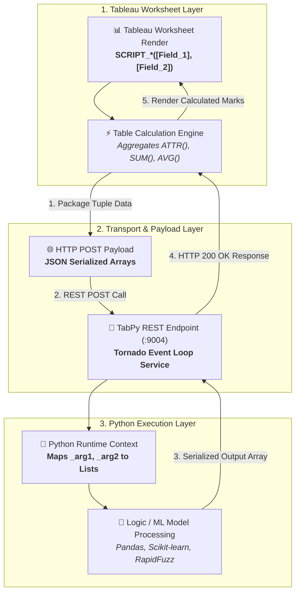
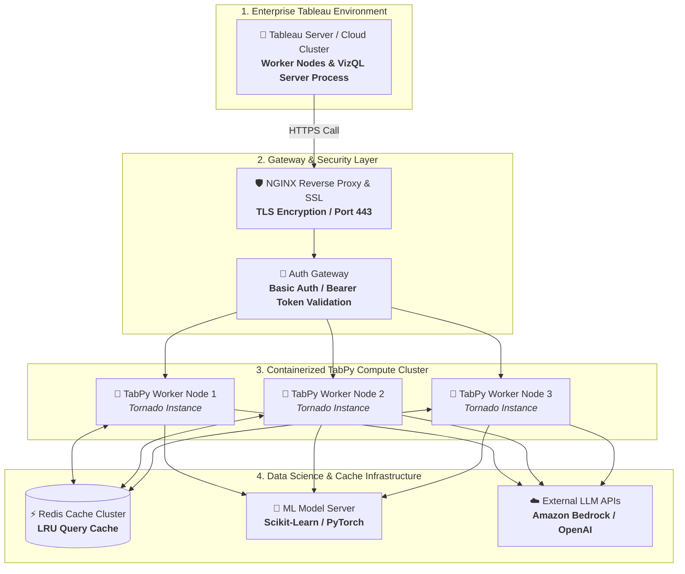

# Bringing Python Into Tableau: A Practical Guide to TabPy Integration

Tableau is excellent at visual analytics, but its calculation engine hits a ceiling fast. Fuzzy text matching, machine learning scoring, live API calls, none of that lives comfortably inside a native calculated field. TabPy closes that gap. It lets Tableau hand off a calculation to a running Python process and get the result back inline, as if it were any other field.

This guide walks through what TabPy actually does, how to wire it up, where it earns its keep, and the architectural patterns required to take it from local prototype to enterprise production.

---

## What TabPy Is, in Plain Terms

TabPy, the Tableau Python Server, is Tableau's official Analytics Extension for Python. Once it's running and connected, Tableau can pass field values into a Python script through a calculated field, run that script inside a Python runtime, and return the result back into the view as a table calculation.

Practically, that opens up four categories of work Tableau can't do on its own:

- **Text processing that goes beyond `CONTAINS`/`REGEXP`**, fuzzy matching, NLP-style cleanup, keyword extraction across long free-text fields.
- **Statistical and ML logic**, running a trained scikit-learn or XGBoost model against live dashboard data for real-time scoring or clustering.
- **External API calls**, pulling in weather, geocoding, or even LLM responses (e.g., OpenAI or Amazon Bedrock) and surfacing them next to the rest of your view.
- **Custom math** that would otherwise mean maintaining a monster nested `IF`/`CASE` calculation.

---

## Data Flow & Architecture Overview

Before wiring up connections, it is vital to understand how Tableau and TabPy communicate during a dashboard render cycle.



---

## Getting It Running Locally

For development, TabPy runs as a local service that Tableau Desktop talks to over HTTP.

### Step 1: Install TabPy Environment

First, install the `tabpy` package using Python's package manager inside your active virtual environment:

```bash
pip install tabpy
```


### Step 1.1: Start the TabPy Service

Launch the TabPy server directly from your command prompt or terminal:

```bash
tabpy
```

Leave that terminal window open, TabPy needs to keep running in the background on port `9004` for the connection to stay alive.


### Step 2: Configure Tableau Desktop Connection

In Tableau Desktop:
1. Navigate to **Help → Settings and Performance → Manage Analytics Extension Connection**.
2. Select **TabPy / External API** as the connection type.
3. Set Hostname to `localhost` and Port to `9004`.
4. Click **Test Connection** to verify before saving.


That's the entire local setup. No complex server config or credentials are required for a local instance, allowing rapid iteration before considering production deployment.

---

## How Tableau Actually Talks to Python

This is the part that trips developers up the first time. Tableau doesn't just let you drop Python anywhere, it routes through four SCRIPT functions, each defined by the data type it expects back from your script:

| Function | Returns | Expected Python Output |
|---|---|---|
| `SCRIPT_BOOL` | Boolean | List of `True` / `False` |
| `SCRIPT_INT` | Integer | List of whole numbers |
| `SCRIPT_REAL` | Decimal | List of floating point numbers |
| `SCRIPT_STR` | String | List of strings |

A basic calculated field using `SCRIPT_STR` looks like this:

```sql
SCRIPT_STR(
    "return [x.upper() if x else '' for x in _arg1]",
    ATTR([Product Name])
)
```


### Critical Rules for SCRIPT Functions

1. **Every field passed in must be aggregated**, `SUM()`, `MIN()`, `ATTR()`, or `AVG()`. Tableau evaluates SCRIPT calls as table calculations. If it isn't told how to collapse multiple rows into one value per mark, it has no way to know what array to hand Python. Passing an unaggregated `[Field]` will throw a syntax error.
2. **Nulls and asterisks come through as `None`.** When `ATTR([Field])` evaluates multiple distinct values within a partition, Tableau returns `*`, which translates to `None` in Python. If your script assumes clean input and doesn't guard for `None`, the script will throw an unhandled exception or return incorrect results.

---

## Worked Examples & Use Cases

### Example 1: Keyword Search Across Free-Text Fields

In domains dealing with long-form text records, insurance policy documents, claims notes, contract clauses, flagging specific exclusion terms is a common requirement. Tableau's native `CONTAINS()` string functions fall short when partial matches, regex synonyms, or running term counts are needed.

```sql
SCRIPT_INT(
    "
import re
text_list = _arg1
terms = ['pre-existing condition', 'act of war', 'self-inflicted']
results = []

for text in text_list:
    if not text:
        results.append(0)
        continue
    count = sum(1 for term in terms if re.search(term, text, re.IGNORECASE))
    results.append(count)

return results
    ",
    ATTR([Policy Clause Text])
)
```


> [!TIP]
> **View Configuration Note**: Turn off **Aggregate Measures** under the *Analysis* menu (or properly set Table Calculation addressing on row dimensions). Otherwise, Tableau collapses rows before Python receives them, resulting in aggregated strings rather than row-by-row analysis.

### Example 2: Fuzzy Entity Matching with RapidFuzz

When matching customer names or vendor records across disparate datasets without a clean primary key, fuzzy matching inside Tableau provides instant data quality feedback:

```sql
SCRIPT_STR(
    "
from rapidfuzz import process, fuzz
input_names = _arg1
target_catalog = ['Acme Corp', 'Apex Logistics', 'Global Tech Solutions', 'Nexus Industries']

matches = []
for name in input_names:
    if not name:
        matches.append('Unknown')
    else:
        best_match, score, _ = process.extractOne(name, target_catalog, scorer=fuzz.token_sort_ratio)
        matches.append(best_match if score > 75 else 'No Match')

return matches
    ",
    ATTR([Vendor Name Input])
)
```

---

## Key Technical Engineering Learnings

### Learning 1: Deployed Functions vs. Inline Scripts (`tabpy_client.deploy`)

Embedding raw multi-line Python strings inside Tableau calculated fields creates severe technical debt: logic is copy-pasted across workbooks, code cannot be unit-tested, and updating logic requires republishing every workbook.

The enterprise solution is deploying pre-compiled Python functions directly to the TabPy server using `tabpy_client`:

```python
import tabpy_client

# Connect to running TabPy instance
client = tabpy_client.Client('http://localhost:9004/')

def calculate_risk_score(claim_amounts, fraud_flags):
    import numpy as np
    scores = []
    for amt, flag in zip(claim_amounts, fraud_flags):
        if amt is None:
            scores.append(0.0)
        else:
            base_score = float(amt) * 0.05
            multiplier = 2.5 if flag == 'Y' else 1.0
            scores.append(round(base_score * multiplier, 2))
    return scores

# Deploy function to TabPy server as an endpoint
client.deploy(
    'calculate_risk_score',
    calculate_risk_score,
    'Calculates policy fraud risk score based on claim amount and flag history',
    override=True
)
print("Function successfully deployed to TabPy endpoint.")
```

Once deployed, the Tableau calculated field simplifies to a single endpoint call:

```sql
SCRIPT_REAL(
    "return tabpy.query('calculate_risk_score', _arg1, _arg2)['response']",
    SUM([Claim Amount]),
    ATTR([Fraud Historical Flag])
)
```


### Learning 2: Vectorized Processing & Memory Footprint Optimization

Passing arrays with thousands of elements to standard Python `for` loops can freeze dashboard interaction. Utilizing Pandas or NumPy inside TabPy vectorized operations speeds up processing by orders of magnitude:

```python
def batch_sentiment_analysis(feedback_texts):
    import pandas as pd
    from textblob import TextBlob
    
    s = pd.Series(feedback_texts).fillna('')
    # Vectorized mapping
    sentiments = s.apply(lambda text: TextBlob(text).sentiment.polarity if text else 0.0)
    return sentiments.tolist()
```

### Learning 3: High-Concurrency Timeout & Circuit Breaker Strategies

By default, Tableau waits up to 30 seconds for an Analytics Extension response before aborting with a query timeout error. In high-concurrency environments with hundreds of active dashboard sessions:
- **Configure Timeouts**: Set `TABPY_TRANSFER_TIMEOUT` in the TabPy config file to prevent runaway threads from starving server memory.
- **Result Caching**: Wrap expensive ML inference models with Redis or `functools.lru_cache` so repeated dashboard filter triggers serve results instantly from cache instead of re-evaluating python functions.

---

## Production Deployment Topology

A local `localhost:9004` setup will fail once a workbook is published to Tableau Server or Cloud. Production TabPy environments require dedicated containerized architecture, SSL encryption, and authentication layers.




### Production Best Practices Checklist

1. **Deploy TabPy in Docker containers** backed by ECS, EKS, or Kubernetes to support horizontal auto-scaling.
2. **Enable HTTPS and Authentication** by configuring TabPy's password files (`tabpy-userfile`) and TLS certificates.
3. **Isolate Python Environments**: Use virtual environments (`venv` or Conda) to avoid library dependency conflicts across deployed functions.

---

## Summary: When TabPy is Worth Reaching For

TabPy is the ideal choice when business logic cannot be expressed in native Tableau calculations (such as fuzzy text matching, complex statistical scoring, ML model scoring, or live external API calls). However, it should not be used as a shortcut to bypass proper data warehouse transformations in dbt, Snowflake, or Databricks.

By utilizing **deployed TabPy endpoints**, **vectorized execution**, and **containerized production topology**, TabPy seamlessly elevates Tableau from a visual reporting tool into an interactive data science platform.
