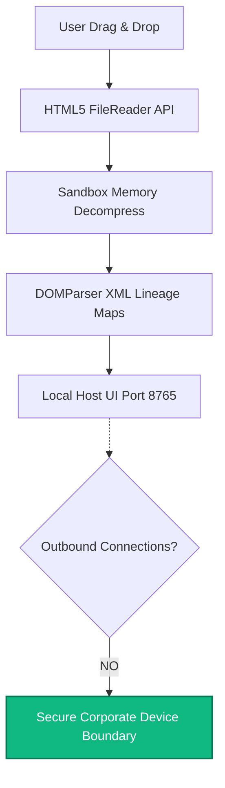
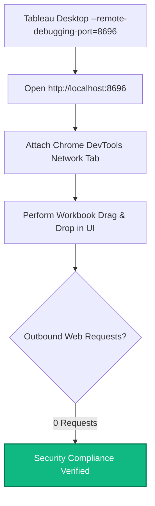
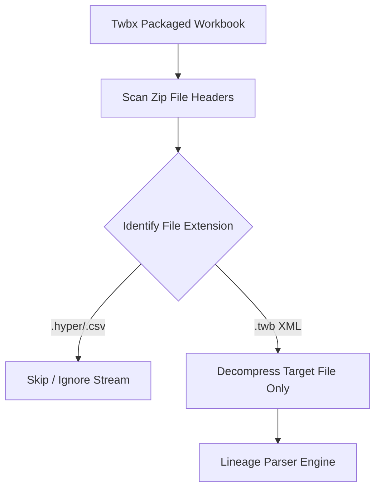

# Hero Section

Title

Workbook Sentinel: Corporate Security Audit & Implementation Guide

Subtitle

A comprehensive security audit, governance risk assessment, and technical review for deploying local-first Tableau metadata parsing extensions in secure enterprise environments.

Reading Information

• Advanced • ⏱️ 10 min read • Tableau, Security

---

# Section 1: Data Leakage, Privacy, & Governance Risk Analysis

### Section Heading
Local Loopback and Sandboxed Processing

### Problem
Corporate data governance policies strictly forbid external transmission of metadata structures. Workbook XML contains proprietary database schemas, calculated fields, SQL logic, and parameter names. Traditional cloud-based parsers expose this IP to external servers, violating data security compliance rules.

### Explanation
Workbook Sentinel resolves this governance risk by operating entirely within the local browser sandbox. When a user drops a `.twb` or `.twbx` workbook, the file is read using the HTML5 FileReader API. The file decompression (using the `fflate` library) and XML parsing (via standard `DOMParser`) execute in temporary sandbox memory. All network traffic is bound to the local loopback interface (`127.0.0.1`). The extension manifest (`extension.trex`) does not request external host permissions or API access, ensuring zero outbound data leakage.

### Visual Diagram

### Best Practices
- Bind extension server ports exclusively to `localhost` or `127.0.0.1`.
- Avoid adding external whitelisted URLs to the `extension.trex` manifest.
- Run dependency libraries (like `fflate`) locally instead of fetching them from external CDNs.

### Summary
Workbook Sentinel keeps all parsed metadata confined to the client machine's memory, eliminating external server dependencies and guaranteeing corporate data privacy.

---

# Section 2: Corporate Security Verification

### Section Heading
Verifying Extension Safety via DevTools

### Problem
Security audit teams require concrete, auditable proof that an extension does not transmit data before whitelisting it. Simply reviewing code is insufficient; teams must monitor runtime network behavior under real use.

### Explanation
Compliance teams can verify the extension's network isolation in under 2 minutes. By launching Tableau Desktop with a remote debugging port enabled, engineers expose the extension's rendering container. Opening a browser tab to that debug port loads Chrome DevTools directly inside the extension's context. Security teams can then monitor the Network tab during parsing to verify that zero external HTTP/S requests are dispatched.

### Visual Diagram

### Best Practices
- Run Tableau with debugging commands: `tableau.exe --remote-debugging-port=8696`.
- Capture a network archive (HAR log) during a full audit to document zero external requests.
- Verify that the extension manifest contains no `<hosts>` nodes targeting external domains.

### Summary
Tableau's remote debugging port allows instant, transparent validation of the extension's network isolation and compliance.

---

# Section 3: Package Compression Limits & Memory Constraints

### Section Heading
Dual-Stage Selective Archive Decompression

### Problem
Packaged workbooks (`.twbx`) bundles both metadata structures (`.twb` XML) and raw data extracts (`.hyper` or `.csv`). These data extracts can range from several hundred megabytes to gigabytes. Decompressing the entire archive inside browser sandbox memory exceeds Chromium's heap limits, causing the tab to crash.

### Explanation
To bypass memory constraints, Workbook Sentinel implements a dual-stage zip filter. The decompression library scans the ZIP file headers first to extract the directory structure without reading file contents. The utility locates the `.twb` XML file index, targeting it specifically. The parser extracts only this lightweight metadata document, skipping the massive binary data files entirely.

### Visual Diagram

### Best Practices
- Never read the entire ZIP archive buffer into memory.
- Filter files by matching header signatures before invoking extraction methods.
- Free up memory by garbage-collecting parsed XML structures as soon as the rendering tree completes.

### Summary
Filtering ZIP archives at the header level prevents memory overflows, allowing users to drop gigabyte-scale workbooks safely.

---

# Section 4: Embedded Browser Lag & DOM Drift

### Section Heading
Managing QtWebEngine Compatibility and XML Versioning

### Problem
Tableau Desktop renders extensions using an embedded Chromium container (QtWebEngine) that lags behind modern desktop browser standards. Using newer DOM methods (like `.closest()`) causes silent crashes in older containers, while Tableau's XML schema definitions can shift between software updates.

### Explanation
To maintain backward compatibility, the extension codebase avoids modern DOM helpers and ES6 features that are unsupported in older embedded runtimes. Node traversal is performed using standard `parentNode` loops and robust polyfills. Additionally, the parsing engine abstracts query selectors to gracefully handle version shifts in Tableau's workbook schemas, ensuring stable calculation mapping across version releases.

### Best Practices
- Test extensions using the exact embedded browser engine version packaged with Tableau Desktop.
- Avoid using cutting-edge JS features without transpilation or polyfills.
- Abstract XML queries into modular helper methods to decouple schema matching from parser logic.

### Summary
Adhering to conservative DOM standards and modularizing XML query selectors guarantees that the parser remains functional across legacy Tableau environments.
